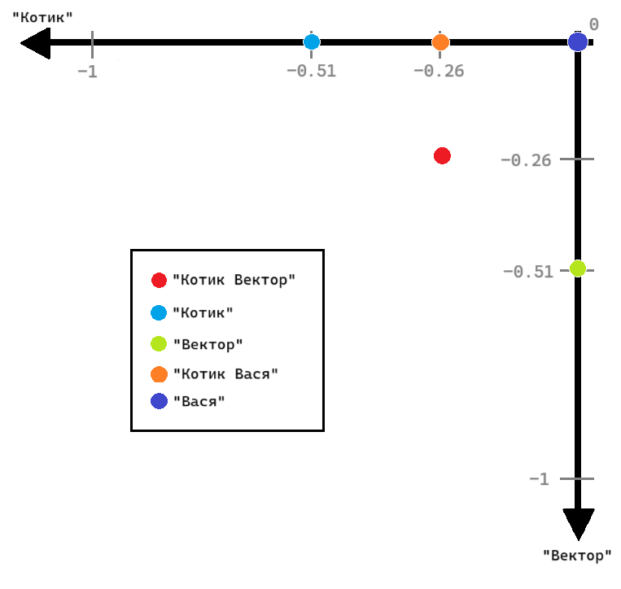
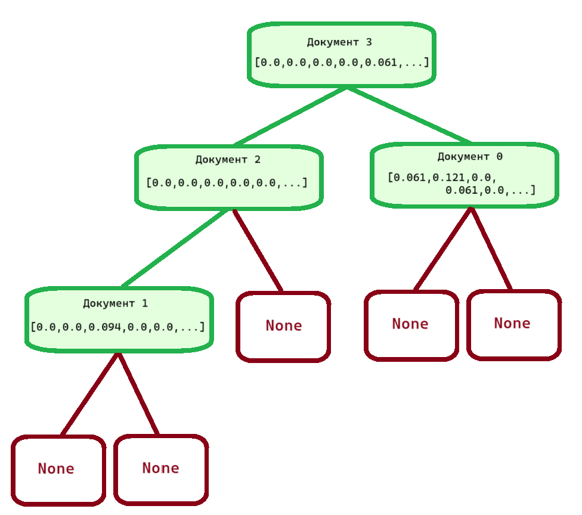
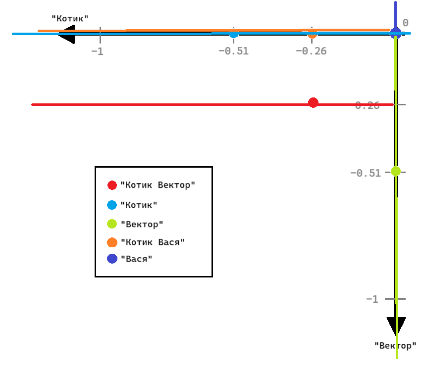
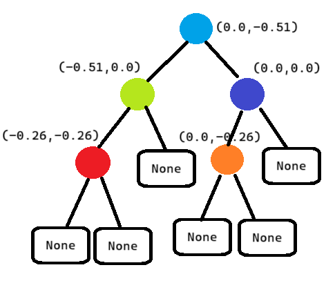
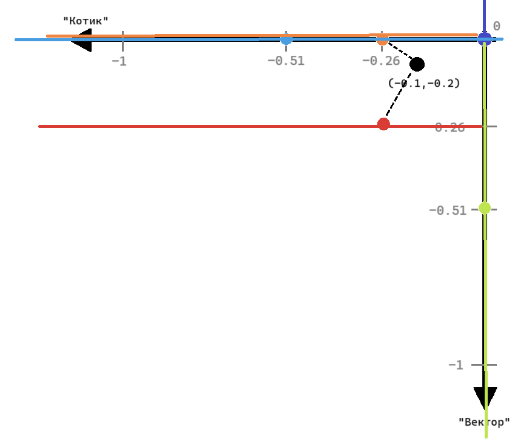

Лабораторная работа №3. Получение релевантных документов на основе векторного поиска
====================================================================================

.. toctree::
    :maxdepth: 1
    :titlesonly:
    :caption: Full API

    lab_3_ann_retriever.api.rst

Дано
----

1. Набор из 589 отрывков новостных статей на русском языке,
   хранящийся в папке ``assets/articles``. Тексты уже импортированы
   в файл ``start.py`` в функции ``open_files()``
   в переменную ``documents`` в виде списка.
2. Список стоп-слов русского языка из библиотеки ``NLTK``,
   хранящийся в файле ``assets/stopwords.txt``. Стоп-слова уже импортированы
   в файл ``start.py`` в функции ``open_files()``
   в переменную ``stopwords`` в виде списка.

В рамках лабораторной работы №2 Вы осуществляли поиск релевантных документов через
вычисление метрик TF-IDF, BM25 и оптимизированной метрики BM25.
Существуют и другие, более сложные алгоритмы поиска релевантных документов.
В ходе выполнения лабораторной работы №3 Вы познакомитесь с векторным поиском
на основе метода KNN и структуры данных KDTree.

Подход, рассматриваемый нами в предыдущей лабораторной, опирается на идею совпадения
токенов в рамках какого-то количества текстов. Векторный подход же строится на идее,
что тексты могут быть представлены в виде точек многомерного пространства. Чтобы
задать координату документа, его представляют в виде набора чисел (вектора). Затем
расстояние между двумя точками можно посчитать, и оно будет указывать на разность
в семантике текстов.

Чем же так хорош `векторный поиск <https://www.datastax.com/guides/what-is-vector-search>`__ ?

1.  Он выдаёт релевантные документы с большей точностью, чем метод поиска через
    одинаковые токены.
2.  Векторы легче, и их не так затратно хранить и использовать,
    особенно на крупных коллекциях.
3.  Он позволяет оперировать понятием семантической близости текстов
    и вычислять её по формулам.
4.  Он работает не только для текстов, но и для изображений и аудио.

Что надо сделать
----------------

Шаг 0. Начать работу над лабораторной (вместе с преподавателем на практике)
~~~~~~~~~~~~~~~~~~~~~~~~~~~~~~~~~~~~~~~~~~~~~~~~~~~~~~~~~~~~~~~~~~~~~~~~~~~

1. Создайте форк репозитория.
2. Установите необходимые инструменты для работы.
3. Измените файлы ``main.py`` и ``start.py``.
4. Закоммитьте изменения и создайте Pull request.

.. important:: В файле ``start.py`` Вы должны написать код, сортирующий
               данные сказки по релевантности запросу.

Для этого реализуйте функции в модуле ``main.py`` и импортируйте их в
``start.py``. Весь код, выполняющий лабораторную работу, должен быть
выполнен в функции ``main`` в файле ``start.py``:

.. code:: py

   def main() -> None:
       pass

Вызов функции в файле ``start.py``:

.. code:: py

   if __name__ == '__main__':
       main()

В рамках данной лабораторной работы **нельзя использовать модули
collections, itertools, а также сторонние модули.**

Обратите внимание, что желаемую оценку необходимо указать в файле
``settings.json`` в поле ``target_score``. Возможные значения: 0, 4, 6, 8, 10.
Чем большее значение выставлено, тем больше тестов будет запущено.

.. note:: Если на вход в методы классов подаются аргументы неправильных типов,
          то возвращается значение ``None``.

Шаг 1. Объявить сущность по подготовке коллекции текстов к векторизации
~~~~~~~~~~~~~~~~~~~~~~~~~~~~~~~~~~~~~~~~~~~~~~~~~~~~~~~~~~~~~~~~~~~~~~~

Первый и ключевой шаг для работы с данными текстами и их
представлением в виде векторов — их токенизация.
Подготовить тексты к векторизации поможет класс
:py:class:`lab_3_ann_retriever.main.Tokenizer`,
который Вы реализуете в ходе выполнения первого шага.

Этот класс ответственен за манипуляции с текстами:
очистку, токенизацию и удаление стоп-слов.
Класс имеет один внутренний атрибут - ``self._stop_words``.
Это список стоп-слов, которые будут удалены из текста.
Во время инициализации он заполняется значением аргумента, переданного в класс.

.. important:: Это защищённый атрибут, то есть обращение к нему за
               пределами методов этого класса не предполагается.

При инициализации экземпляра класса в ``start.py`` стоит подать в качестве аргумента
стоп-слова, которые загружены через функцию
:py:func:`lab_3_ann_retriever.start.open_files`.

Пример инициализации экземпляра:

.. code:: py

    stopwords = open_files()[1]
    tokenizer = Tokenizer(stopwords)

Шаг 1.1. Удалить стоп-слова из списка токенов
~~~~~~~~~~~~~~~~~~~~~~~~~~~~~~~~~~~~~~~~~~~~~

Реализуйте метод
:py:meth:`lab_3_ann_retriever.main.Tokenizer._remove_stop_words`,
который позволяет удалять стоп-слова из списка токенов документа.

Например, пусть на вход дан текст, который был предварительно разбит на токены:
``['мой', 'кот', 'вектор', 'по', 'утрам', 'приносит', 'мне', 'тапочки',
'а', 'по', 'вечерам', 'мы', 'гуляем', 'с', 'ним', 'на', 'шлейке', 'во',
'дворе', 'вектор', 'забавный', 'и', 'храбрый', 'он', 'не', 'боится', 'собак']``.
Тогда метод :py:meth:`lab_3_ann_retriever.main.Tokenizer._remove_stop_words`
вернёт следующий список строк: ``['кот', 'вектор', 'утрам', 'приносит', 'тапочки',
'вечерам', 'гуляем', 'шлейке', 'дворе', 'вектор', 'забавный', 'храбрый', 'боится',
'собак']``.

В качестве списка стоп-слов используйте список, сохранённый в атрибуте
экземпляра класса ``_stop_words``.

.. important:: Это защищённый метод, то есть обращение к нему за
               пределами других методов этого класса не предполагается.

Шаг 1.2. Токенизировать документ
~~~~~~~~~~~~~~~~~~~~~~~~~~~~~~~~

Реализуйте метод :py:meth:`lab_3_ann_retriever.main.Tokenizer.tokenize`,
который позволяет разбить текст на токены (слова). Текст должен быть приведён
к нижнему регистру и очищен от знаков препинания и цифр.
То есть если на вход методу передаётся текст ``"Мой кот Вектор по утрам приносит
мне тапочки, а по вечерам мы гуляем с ним на шлейке во дворе. Вектор забавный
и храбрый. Он не боится собак!"``, то метод вернёт итоговый список строк:
``['кот', 'вектор', 'утрам', 'приносит', 'тапочки', 'вечерам', 'гуляем',
'шлейке', 'дворе', 'вектор', 'забавный', 'храбрый', 'боится', 'собак']``.

Вызов данного метода может выглядеть следующим образом:

.. code:: py

    doc = 'Мой кот Вектор...'
    tokenized_doc = tokenizer.tokenize(doc)

.. note:: Данный метод обязательно должен вызывать метод
          :py:meth:`lab_3_ann_retriever.main.Tokenizer._remove_stop_words`,
          который Вы реализовали на Шаге 1.1.

Шаг 1.3. Токенизировать документы
~~~~~~~~~~~~~~~~~~~~~~~~~~~~~~~~~

Реализуйте метод :py:meth:`lab_3_ann_retriever.main.Tokenizer.tokenize_documents`,
который отвечает за токенизацию списка текстов.

Например, если на вход методу будет подан список документов:
``['Векторы используются для поиска релевантного документа. Давайте
научимся, как их создавать и использовать!', 'Мой кот Вектор по утрам
приносит мне тапочки, а по вечерам мы гуляем с ним на шлейке во дворе.
Вектор забавный и храбрый. Он не боится собак!', 'Котёнок, которого мы
нашли во дворе, очень забавный и пушистый. По утрам я играю с ним в
догонялки перед работой.', 'Моя собака думает, что её любимый плед —
это кошка. Просто он очень пушистый и мягкий. Забавно наблюдать, как
они спят вместе!']``, то результатом работы метода будет следующий
список: ``[['векторы', 'используются', 'поиска', 'релевантного',
'документа', 'давайте', 'научимся', 'создавать', 'использовать'], ['кот',
'вектор', 'утрам', 'приносит', 'тапочки', 'вечерам', 'гуляем', 'шлейке',
'дворе', 'вектор', 'забавный', 'храбрый', 'боится', 'собак'], ['котёнок',
'которого', 'нашли', 'дворе', 'очень', 'забавный', 'пушистый', 'утрам',
'играю', 'догонялки', 'работой'], ['собака', 'думает', 'любимый',
'плед', 'это', 'кошка', 'просто', 'очень', 'пушистый', 'мягкий',
'забавно', 'наблюдать', 'спят', 'вместе']]``.

Вызов данного метода может выглядеть следующим образом:

.. code:: py

    docs = ['Векторы используются для...', 'Мой кот Вектор...']
    tokenized_docs = tokenizer.tokenize_documents(docs)

.. note:: Данный метод обязательно должен вызывать метод
          :py:meth:`lab_3_ann_retriever.main.Tokenizer.tokenize`,
          реализованный Вами на Шаге 1.2.

Шаг 1.4. Продемонстрировать результаты в ``start.py``
~~~~~~~~~~~~~~~~~~~~~~~~~~~~~~~~~~~~~~~~~~~~~~~~~~~~~

.. important:: Выполнение Шага 1 соответствует 4 баллам.

Продемонстрируйте результат токенизации документов ``documents``
в функции ``main()`` модуля ``start.py`` с помощью экземпляра класса
:py:class:`lab_3_ann_retriever.main.Tokenizer`.
Используйте стоп-слова из списка ``stopwords``, возвращаемого функцией
:py:func:`lab_3_ann_retriever.start.open_files` в модуле ``start.py``.

Шаг 2. Объявить сущность по созданию векторного представления документа
~~~~~~~~~~~~~~~~~~~~~~~~~~~~~~~~~~~~~~~~~~~~~~~~~~~~~~~~~~~~~~~~~~~~~~~

Векторное представление текста подразумевает перевод данного
текста в набор чисел (вектор). В данной лабораторной работе за
их вид отвечает тип :py:class:`lab_3_ann_retriever.main.Vector`,
являющийся кортежем чисел с плавающей точкой.

Существует множество подходов к векторизации,
но мы будем использовать уже знакомую нам метрику ``TF-IDF``
(`Term frequency–inverse document frequency <https://ru.wikipedia.org/wiki/TF-IDF>`__).
Для начала зададим N-мерное пространство, которое представляет собой
все уникальные токены коллекции. Каждому токену присваивается своя ось отсчёта (axis),
по которой затем откладываются значения, в нашем случае TF-IDF для конкретного документа.
Координаты получившейся точки и являются векторами.

Представим, что у нас есть коллекция из трёх токенизированных документов:
``["Котик", "Вектор"], ["Котик"], ["Вектор"]``. Так как коллекция содержит
два уникальных токена, мы можем представить коллекцию как двухмерное пространство.
На каждой оси откладывается значение метрики ``TF-IDF`` для каждого документа.
Эти значения получаются следующие:
``[{'Вектор': -0.26, 'Котик': -0.26}, {'Вектор': 0.0, 'Котик': -0.51},
{'Вектор': -0.51, 'Котик': 0.0}]``.
На пересечении значений по осям находятся точки соответствующих документов.

Важно, что размерность заданного пространства нельзя менять. Поэтому для документов,
которые содержат токены, не входящие в изначальный список уникальных токенов коллекции,
нельзя добавлять дополнительные значения.

Возьмём два других токенизированных документа: ``[["Котик", "Вася"], ["Вася"]]``.
Мы не можем увеличить размерность нашего пространства и добавить токен ``"Вася"``,
поэтому мы будем рассматривать только токены известных нам осей и получим ``TF-IDF``:
``[{'Вектор': 0.0, 'Котик': -0.26}, {'Вектор': 0.0, 'Котик': 0.0}]``.

Визуализацию полученного пространства можно увидеть на следующей картинке:

Как видно, точка документа ``"Котик Вася"`` имеет только составляющую
вектора по оси ``"Котик"``, а точка документа ``"Вася"`` находится
в начале координат, несмотря на то что документ непустой.
Итоговые векторы документов коллекции будут выглядеть как ``(-0.26, -0.26)``,
``(0.0, -0.51)`` и ``(-0.51, 0.0)``, а для двух дополнительных документов
``(0.0, -0.26)`` и ``(0.0, 0.0)``.

Заметьте, что порядок значений токенов во всех векторах должен быть одинаковым,
так как каждый индекс в векторе указывает на конкретную ось (axis), по
которой находится значение, то есть на конкретный токен.
По этой причине для визуализации векторного представления текстов чаще
используют таблицы, а не диаграммы, ведь нарисовать многомерное пространство
намного сложнее.

Таким образом, наше итоговое пространство можно представить в виде таблицы:

.. list-table::
   :widths: 50 25 25
   :header-rows: 1

   * - Документ
     - "Вектор"
     - "Котик"
   * - 0
     - -0.26
     - -0.26
   * - 1
     - 0.0
     - -0.51
   * - 2
     - -0.51
     - 0.0
   * - 3
     - 0.0
     - -0.26
   * - 4
     - 0.0
     - 0.0

На Шагах 2-2.3 Вам предстоит реализовать класс
:py:class:`lab_3_ann_retriever.main.Vectorizer`,
вычисляющий векторы для данных документов на основе ``TF-IDF``.
В этом классе есть следующие атрибуты:

1. ``self._corpus`` — коллекция токенизированных документов,
   которая подаётся на вход в векторайзер при инициализации экземпляра класса.
2. ``self._idf_values`` — словарь со значениями ``IDF`` для уникальных токенов из
   коллекции документов, который на данном этапе должен быть пустым.
3. ``self._vocabulary`` — отсортированный в алфавитном порядке список уникальных
   токенов из коллекции документов, который на этапе инициализации должен быть пустым.
4. ``self._token2ind`` — словарь для получения индекса токена в ``self._vocabulary``,
   который на этапе инициализации должен быть пустым.

Пример инициализации экземпляра класса:

.. code:: py

    tokenized_docs = [["векторы", "используются"], ["кот", "вектор"]]
    vectorizer = Vectorizer(tokenized_docs)

.. hint:: В лабораторной работе №2 Вы уже рассчитывали ``TF-IDF``,
          поэтому здесь Вам пригодятся те функции, которые Вы реализовывали.

Шаг 2.1. Заполнить векторайзер документами
~~~~~~~~~~~~~~~~~~~~~~~~~~~~~~~~~~~~~~~~~~

На данном шаге Вам нужно реализовать метод
:py:meth:`lab_3_ann_retriever.main.Vectorizer.build`, который заполнит атрибуты
``self._idf_values``, ``self._vocabulary`` и ``self._token2ind``.
То есть если на вход методу подаются списки токенов коллекции документов
из Шага 1.3, то после выполнения метода атрибуты экземпляра класса будут
иметь следующие значения:

- ``self._idf_values = {'боится': 0.847, 'вектор': 0.847, 'вектора': 0.847,
  'вечерам': 0.847, 'вместе': 0.847, 'гуляем': 0.847, 'давайте': 0.847,
  'дворе': 0.0, 'догонялки': 0.847, 'документа': 0.847, 'думает': 0.847,
  'забавно': 0.847, 'забавный': 0.0, 'играю': 0.847, 'использовать': 0.847,
  'используются': 0.847, 'кот': 0.847, 'которого': 0.847, 'котёнок': 0.847,
  'кошка': 0.847, 'любимый': 0.847, 'мягкий': 0.847, 'наблюдать': 0.847,
  'научимся': 0.847, 'нашли': 0.847, 'очень': 0.0, 'плед': 0.847,
  'поиска': 0.847, 'приносит': 0.847, 'просто': 0.847, 'пушистый': 0.0,
  'работой': 0.847, 'релевантного': 0.847, 'собак': 0.847, 'собака': 0.847,
  'создавать': 0.847, 'спят': 0.847, 'тапочки': 0.847, 'утрам': 0.0,
  'храбрый': 0.847, 'шлейке': 0.847, 'это': 0.847}``
- ``self._vocabulary = ['боится', 'вектор', 'вектора', 'вечерам', 'вместе',
  'гуляем', 'давайте', 'дворе', 'догонялки', 'документа', 'думает', 'забавно',
  'забавный', 'играю', 'использовать', 'используются', 'кот', 'которого',
  'котёнок', 'кошка', 'любимый', 'мягкий', 'наблюдать', 'научимся', 'нашли',
  'очень', 'плед', 'поиска', 'приносит', 'просто', 'пушистый', 'работой',
  'релевантного', 'собак', 'собака', 'создавать', 'спят', 'тапочки', 'утрам',
  'храбрый', 'шлейке', 'это']``
- ``self._token2ind = {'боится': 0, 'вектор': 1, 'вектора': 2, 'вечерам': 3,
  'вместе': 4, 'гуляем': 5, 'давайте': 6, 'дворе': 7, 'догонялки': 8,
  'документа': 9, 'думает': 10, 'забавно': 11, 'забавный': 12, 'играю': 13,
  'использовать': 14, 'используются': 15, 'кот': 16, 'которого': 17,
  'котёнок': 18, 'кошка': 19, 'любимый': 20, 'мягкий': 21, 'наблюдать': 22,
  'научимся': 23, 'нашли': 24, 'очень': 25, 'плед': 26, 'поиска': 27,
  'приносит': 28, 'просто': 29, 'пушистый': 30, 'работой': 31,
  'релевантного': 32, 'собак': 33, 'собака': 34, 'создавать': 35, 'спят': 36,
  'тапочки': 37, 'утрам': 38, 'храбрый': 39, 'шлейке': 40, 'это': 41}``

.. important:: Для вычисления значений ``IDF`` для всей коллекции используйте
               функцию :py:func:`lab_2_retrieval_w_bm25.main.calculate_idf`.

Метод должен возвращать логическое значение ``True``, если атрибуты
были успешно заполнены и не содержат значений ``None``, иначе ``False``.

Вызов данного метода может выглядеть следующим образом:

.. code:: py

    tokenized_docs = [["векторы", "используются"], ["кот", "вектор"]]
    vectorizer = Vectorizer(tokenized_docs)
    vectorizer.build()

Шаг 2.2. Посчитать TF-IDF для документа
~~~~~~~~~~~~~~~~~~~~~~~~~~~~~~~~~~~~~~~

Реализуйте метод :py:meth:`lab_3_ann_retriever.main.Vectorizer._calculate_tf_idf`,
который вычисляет ``TF-IDF`` и создаёт вектор документа.
Для того чтобы сразу учесть неизменяемость размерности вектора, создайте
вектор из нулей длины списка ``self._vocabulary``, который далее заполните
значениями ``TF-IDF``.

.. important:: Для вычисления метрики ``TF`` для токенов документа
               используйте функцию :py:func:`lab_2_retrieval_w_bm25.main.calculate_tf`.

Для каждого токена документа вычислите ``TF-IDF`` и заполните значение
исходного нулевого вектора по индексу токена в ``self._vocabulary``.
В качестве ``IDF`` метрики используйте значения соответствующего атрибута.
Напомним, что формула метрики выглядит следующим образом: :math:`TF \cdot IDF`

Например, вектор уже знакомого нам текста про кота Вектора на списке
уникальных токенов будет выглядеть так:
``(0.061, 0.121, 0.0, 0.061, 0.0, 0.061, 0.0, 0.0, 0.0, 0.0, 0.0, 0.0, 0.0,
0.0, 0.0, 0.0, 0.061, 0.0, 0.0, 0.0, 0.0, 0.0, 0.0, 0.0, 0.0, 0.0, 0.0, 0.0,
0.061, 0.0, 0.0, 0.0, 0.0, 0.061, 0.0, 0.0, 0.0, 0.061, 0.0, 0.061, 0.061, 0.0)``.

Шаг 2.3. Векторизовать документ
~~~~~~~~~~~~~~~~~~~~~~~~~~~~~~~

Реализуйте метод :py:meth:`lab_3_ann_retriever.main.Vectorizer.vectorize`,
который возвращает векторное представления документа.

.. important:: Метод должен вызывать защищённый метод
               :py:meth:`lab_3_ann_retriever.main.Vectorizer._calculate_tf_idf`.

Вызов данного метода может выглядеть следующим образом:

.. code:: py

    tokenized_docs = [["векторы", "используются"], ["кот", "вектор"]]
    vectorizer = Vectorizer(tokenized_docs)
    vectorizer.vectorize(tokenized_docs[0])

Шаг 3. Посчитать Евклидово расстояние
~~~~~~~~~~~~~~~~~~~~~~~~~~~~~~~~~~~~~

Для дальнейшего использования векторов нам нужно вычислить расстояние
между ними. Есть множество способов, как вычислить расстояние между соседствующими
объектами, но мы остановимся на Евклидовом расстоянии.

В общем виде Евклидово расстояние определяется как длина отрезка между
двумя объектами в N-мерном пространстве. Тогда для нашего
случая Евклидово расстояние будет вычисляться по формуле
:math:`\sqrt{\sum^{n}_{i=1}(q_i - v_i)^2}`, где:

* :math:`n` — размерность вектора;
* :math:`i` — индекс значения в векторе;
* :math:`q_i` и :math:`v_i` — числовые значения по индексу :math:`i` в
  векторе запроса и векторе коллекции.

Реализуйте функцию
:py:func:`lab_3_ann_retriever.main.calculate_distance`
которая вычисляет Евклидово расстояния по формуле от вектора запроса до
каждого из векторов документов на входе.

Посмотрим на 4 вектора нашей коллекции:
``[(0.0, 0.0, 0.094, 0.0, 0.0, 0.0, 0.094, 0.0, 0.0, 0.094, 0.0, 0.0, 0.0, 0.0, 0.094,
0.094, 0.0, 0.0, 0.0, 0.0, 0.0, 0.0, 0.0, 0.094, 0.0, 0.0, 0.0, 0.094, 0.0, 0.0, 0.0,
0.0, 0.094, 0.0, 0.0, 0.094, 0.0, 0.0, 0.0, 0.0, 0.0, 0.0), (0.061, 0.121, 0.0, 0.061,
0.0, 0.061, 0.0, 0.0, 0.0, 0.0, 0.0, 0.0, 0.0, 0.0, 0.0, 0.0, 0.061, 0.0, 0.0, 0.0, 0.0,
0.0, 0.0, 0.0, 0.0, 0.0, 0.0, 0.0, 0.061, 0.0, 0.0, 0.0, 0.0, 0.061, 0.0, 0.0, 0.0,
0.061, 0.0, 0.061, 0.061, 0.0), (0.0, 0.0, 0.0, 0.0, 0.0, 0.0, 0.0, 0.0, 0.077, 0.0,
0.0, 0.0, 0.0, 0.077, 0.0, 0.0, 0.0, 0.077, 0.077, 0.0, 0.0, 0.0, 0.0, 0.0, 0.077, 0.0,
0.0, 0.0, 0.0, 0.0, 0.0, 0.077, 0.0, 0.0, 0.0, 0.0, 0.0, 0.0, 0.0, 0.0, 0.0, 0.0), (0.0,
0.0, 0.0, 0.0, 0.061, 0.0, 0.0, 0.0, 0.0, 0.0, 0.061, 0.061, 0.0, 0.0, 0.0, 0.0, 0.0,
0.0, 0.0, 0.061, 0.061, 0.061, 0.061, 0.0, 0.0, 0.0, 0.061, 0.0, 0.0, 0.061, 0.0, 0.0,
0.0, 0.0, 0.061, 0.0, 0.061, 0.0, 0.0, 0.0, 0.0, 0.061)]``.
Если посчитать расстояние от вектора нулевого текста из нашей
коллекции примеров (про использование векторов) до всех текстов коллекции,
то мы получим следующие значения в порядке документов коллекции:
``0.0, 0.357, 0.34, 0.352``.

Шаг 4. Реализовать алгоритм поиска K-ближайших соседей
~~~~~~~~~~~~~~~~~~~~~~~~~~~~~~~~~~~~~~~~~~~~~~~~~~~~~~

Теперь, когда мы умеем создавать векторы и вычислять расстояние между ними,
нам нужно научиться находить векторы коллекции, которые находятся на минимальном
расстоянии от вектора запроса.
Для этого мы реализуем алгоритм, который называется метод K-ближайших соседей
(`KNN/K-Nearest Neighbours <https://habr.com/ru/articles/801885/>`__).
Это классический алгоритм, который используют для решения задачи классификации и
регрессии. Мы будем применять его для поиска документов в векторном пространстве.

Принцип работы KNN для векторного поиска достаточно прост:

1. Вычислить расстояние между вектором запроса и всеми векторами
   изначальной коллекции.
2. Выбрать k документов с наименьшим расстоянием между вектором запроса и
   векторами коллекции.

Для исполнения алгоритма K-ближайших соседей реализуйте класс
:py:class:`lab_3_ann_retriever.main.BasicSearchEngine`,
который по запросу выдаёт k ближайших по векторам документов.
В этом классе есть следующие атрибуты:

- ``self._tokenizer`` — экземпляр класса ``Tokenizer``;
- ``self._vectorizer`` — экземпляр класса ``Vectorizer``;
- ``self._documents`` — список документов (текстов) коллекции,
  который на момент инициализации должен быть пустой;
- ``self._document_vectors`` — список векторов коллекции,
  который на данном этапе тоже должен быть пустой.

Пример инициализации экземпляра класса:

.. code:: py

    documents, stopwords = open_files()
    tokenizer = Tokenizer(stopwords)
    tokenized_docs = tokenizer.tokenize_documents(documents)
    vectorizer = Vectorizer(tokenized_docs)
    vectorizer.build()
    knn_retriever = BasicSearchEngine(vectorizer, tokenizer)

Шаг 4.1. Векторизовать документ для поиска
~~~~~~~~~~~~~~~~~~~~~~~~~~~~~~~~~~~~~~~~~~

На этом Шаге реализуйте метод
:py:meth:`lab_3_ann_retriever.main.BasicSearchEngine._index_document`,
который использует токенайзер и векторайзер для создания вектора документа.

.. hint:: Токенизируйте документ на входе через метод атрибута ``self._tokenizer.tokenize``,
          а затем постройте для документа вектор через метод ``self._vectorizer.vectorize``.

Например, для документа про собаку на выходе получится вектор
``(0.0, 0.0, 0.0, 0.0, 0.061, 0.0, 0.0, 0.0, 0.0, 0.0, 0.061, 0.061, 0.0, 0.0, 0.0, 0.0,
0.0, 0.0, 0.0, 0.061, 0.061, 0.061, 0.061, 0.0, 0.0, 0.0, 0.061, 0.0, 0.0, 0.061, 0.0,
0.0, 0.0, 0.0, 0.061, 0.0, 0.061, 0.0, 0.0, 0.0, 0.0, 0.061)``.

Шаг 4.2. Заполнить атрибуты класса несколькими документами
~~~~~~~~~~~~~~~~~~~~~~~~~~~~~~~~~~~~~~~~~~~~~~~~~~~~~~~~~~

Теперь реализуйте метод
:py:meth:`lab_3_ann_retriever.main.BasicSearchEngine.index_documents`,
который должен заполнять атрибуты класса.
Сохраните документы из коллекции в атрибуте ``self._documents``.
Также для каждого документа коллекции создайте вектор и
сохраните его в атрибуте ``self._document_vectors``.
Метод должен возвращать ``True``, если все тексты удалось векторизовать, иначе ``False``.

Пример использования метода класса:

.. code:: py

    documents = ['Вектора используются для...', 'Мой кот Вектор...']
    knn_retriever.index_documents(documents)

.. important:: Этот метод обязательно должен вызывать метод
               :py:meth:`lab_3_ann_retriever.main.BasicSearchEngine._index_document`.

Шаг 4.3. Найти k ближайших соседей
~~~~~~~~~~~~~~~~~~~~~~~~~~~~~~~~~~

Теперь Вам нужно реализовать второй шаг алгоритма K-ближайших соседей (KNN)
в методе :py:meth:`lab_3_ann_retriever.main.BasicSearchEngine._calculate_knn`,
то есть выбрать k документов из коллекции, Евклидово расстояние от которых
до запроса наименьшее. Отсортируйте получившийся список по возрастанию расстояния.

.. important:: В данном методе обязательно должна быть использована функция
               :py:func:`lab_3_ann_retriever.main.calculate_distance`.

Если использовать в качестве документа запроса нулевой текст коллекции примеров,
а количество соседей поставить равным 4, то мы получим
``[(0, 0.0), (2, 0.34), (3, 0.352), (1, 0.357)]``. Это индексы документов,
которые лучше всего подходят запросу, и расстояния между их векторами и вектором запроса.
Они соответствуют значениям, которые мы посчитали на Шаге 3.

Шаг 4.4. Получить список k документов по запросу
~~~~~~~~~~~~~~~~~~~~~~~~~~~~~~~~~~~~~~~~~~~~~~~~

Теперь реализуйте поиск ближайших соседей по запросу с помощью метода
:py:meth:`lab_3_ann_retriever.main.BasicSearchEngine.retrieve_relevant_documents`.
На вход подаётся строка запроса и количество соседей,
которое мы хотим получить. Токенизируйте и векторизуйте запрос,
а затем с помощью метода
:py:meth:`lab_3_ann_retriever.main.BasicSearchEngine._calculate_knn`
отыщите наиболее релевантные запросу документы. Важно вернуть пару расстояния и
самого текста документа, а не его вектора.

Например, у нас есть коллекция из четырёх документов, рассмотренных ранее
в примерах, и запрос ``"Мои кот и собака не дружат!"``. Из четырёх документов
мы хотим найти 2 самых релевантных.
При правильной реализации метода, он вернёт следующие значения:
``[(0.329, "Моя собака думает, что её любимый плед — это кошка. Просто он очень
пушистый и мягкий. Забавно наблюдать, как они спят вместе!"), (0.334, "Мой кот
Вектор по утрам приносит мне тапочки, а по вечерам мы гуляем с ним на шлейке во
дворе. Вектор забавный и храбрый. Он не боится собак!")]``.

Пример использования метода класса:

.. code:: py

    knn_retriever = BasicSearchEngine(vectorizer=vectorizer, tokenizer=tokenizer)
    knn_retriever.index_documents(documents)
    knn_retriever.retrieve_relevant_documents("Мои кот и собака не дружат!", 2)

Шаг 5. Получить токены вектора
~~~~~~~~~~~~~~~~~~~~~~~~~~~~~~

Помимо создания вектора для токенизированного текста нам также может понадобиться
получить токены для вектора, который не сохранён в атрибуте
``self._vectorizer._documents``, но построен в нужном нам пространстве.
Расширьте класс :py:class:`lab_3_ann_retriever.main.Vectorizer` методом
:py:meth:`lab_3_ann_retriever.main.Vectorizer.vector2tokens`.

Данный метод отвечает за возвращение тех токенов, которые присутствовали в
токенизированном представлении данного вектора до применения векторизации.
Обязательно используйте атрибут ``self._token2ind`` для нахождения
конкретных токенов. Верните полученные токены в алфавитном порядке.

Так, для нулевого документа из коллекции примеров получится следующий
список токенов: ``['вектора', 'давайте', 'документа', 'использовать',
'используются', 'научимся', 'поиска', 'релевантного', 'создавать']``.
Несмотря на отсутствие стоп-слов и невозможность понять, сколько раз
тот или иной токен встречался в изначальном тексте, по такому списку
можно примерно понять смысл изначального содержания.

Пример использования метода класса:

.. code:: py

    vectorizer = Vectorizer(tokenized_documents)
    vectorizer.build()
    vectorizer.vector2tokens((0.0, 0.0, 0.094))

Шаг 5.1. Найти самый релевантный документ по вектору
~~~~~~~~~~~~~~~~~~~~~~~~~~~~~~~~~~~~~~~~~~~~~~~~~~~~

Теперь реализуйте дополнительный метод
:py:meth:`lab_3_ann_retriever.main.BasicSearchEngine.retrieve_vectorized`,
который будет полезен для поиска самого релевантного документа для запроса,
который изначально представлен как вектор.

.. important:: Для того чтобы найти единственный наиболее релевантный документ
               среди документов коллекции, используйте метод
               :py:meth:`lab_3_ann_retriever.main.BasicSearchEngine._calculate_knn`.

Для того же вектора нулевого текста метод поиска выдаст результат:
``"Векторы используются для поиска релевантного документа. Давайте научимся,
как их создавать и использовать!"``

Пример использования метода класса:

.. code:: py

    knn_retriever = BasicSearchEngine(vectorizer=vectorizer, tokenizer=tokenizer)
    knn_retriever.index_documents(documents)
    knn_retriever.retrieve_vectorized((0.0, 0.0, 0.094))

Шаг 5.2. Продемонстрировать результаты в ``start.py``
~~~~~~~~~~~~~~~~~~~~~~~~~~~~~~~~~~~~~~~~~~~~~~~~~~~~~

.. important:: Выполнение Шагов 2-5 соответствует 6 баллам.

Продемонстрируйте работу методов
:py:meth:`lab_3_ann_retriever.main.Vectorizer.vector2tokens`
и :py:meth:`lab_3_ann_retriever.main.BasicSearchEngine.retrieve_vectorized`
в модуле ``start.py``.

Используйте секретное содержимое любого файла из папки ``assets/secrets``.
В файлах содержатся 5 векторов, построенных в системе документов из
папки ``assets/articles``. Выполните следующие два шага:

1.  По полученным из загадочного вектора токенам предположите, какой вопрос был
    зашифрован в изначальном тексте.
2.  Найдите документ, наиболее релевантный для вектора запроса, и ответьте на
    поставленный вопрос.

.. important:: В полученных документах есть инструкция о получении бонуса к
               накопленной оценке за курс. При этом **количество бонусов ограничено**.
               Один студент может отгадать не более одной загадки.
               Поэтому только первые 5 студентов, которые справятся с заданием,
               смогут получить бонус. Решение о применении бонуса принимается
               ментором и не подлежит оспариванию. Студент получит бонус, только
               если на момент выполнения задания в его форке опубликован
               актуальный код, который позволяет воспроизвести результат.

Шаг 6. Создать К-мерное дерево
~~~~~~~~~~~~~~~~~~~~~~~~~~~~~~

Теперь мы рассмотрим структуру данных
`KD-Tree (К-мерное дерево) <https://habr.com/ru/articles/312882/>`__.

Общая идея заключается в том, чтобы разбить многомерное пространство,
в котором лежат векторы наших документов, на части по некоторому
условию. Это позволит значительно сузить диапазон поиска ближайшего
соседа, то есть самого релевантного документа.
Он не настолько прост, как другие алгоритмы, но для достаточно
крупного количества объектов его производительность оправдывает
использование.

Рассмотрим подробнее структуру дерева, которая должна получиться из нашей
коллекции четырёх примеров при правильной реализации Шагов 6-7.
На рисунке подписано, какие по индексу документы олицетворяет каждый блок.

Дерево состоит из узлов (nodes), которые представлены блоками на схеме.
В узлах хранится информация о его узлах-детях (с которыми он соединён зелёной линией)
и координаты точки пространства, которую данный узел олицетворяет.

Самый верхний узел, относящийся к документу с индексом 3, называется корнем (root)
дерева, а красные узлы, у которых нет собственных узлов-детей, называются листьями
(leafs). Они по умолчанию заполняются специальными значениями ``None``. У узлов, не
являющихся листьями, должно быть по два узла-ребёнка.

Корень дерева находится на нулевой глубине (depth), и каждый раз, когда мы спускаемся
вниз к узлам-детям, мы прибавляем глубину. Так, документы 0 и 2 находятся на глубине 1,
а документ 1 — на глубине 2. Глубина используется во время деления N-мерного пространства
на подпространства.

Так как концепция дерева основывается на делении многомерного пространства
на подпространства, опишем процесс на примере уже знакомой нам двумерной плоскости с
пятью точками.

Существует всё пространство - белая часть рисунка.
Если в пространстве есть несколько точек, его нужно поделить на подпространства
по некоторому правилу, пока не найдётся подпространство с единственной точкой.
Деление происходит плоскостью, перпендикулярной одной из осей координат.

Можно по-разному задавать условие разделения на подпространства. В нашем случае
в качестве точки, по которой будет происходить разделение, мы будем брать медиану.
Вычислять медианную точку будем следующим образом.
Сначала в пространстве выбирается первая точка — корневой узел,
по которой мы будем разбивать пространство в первый раз на две части. В нашем
случае это точка текста «Котик», синяя, и линия деления (соответствующего
цвета), которая будет перпендикулярно идти оси «Вектор».
Зелёная и красные точки оказываются в левом подпространстве,
а фиолетовая и оранжевая — в правом.

Далее берётся одно из полученных подпространств — мы перемещаемся глубже на уровень,
на глубину 1, в пространство более мелкого размера. Его также нужно разделить точкой
по правилу. Эта и другие точки деления будут называться **узлами**.
В левом подпространстве узлом будет зелёная точка, и деление будет происходить по
значению оси «Котик». Тогда в правом подпространстве у данного узла будет ничего,
то есть эквивалент ``None``, а в левом будет красная точка, деление которой приведёт
к двум пустым подпространствам.

Деление и переход в более мелкие подпространства будет происходить до тех пор,
пока в новом пространстве есть точки. Если после деления ни в одном из
подпространств нет точек, которые ещё не были узлами, то этот узел является листом.

В правом подпространстве узла-корня деление будет происходить по фиолетовой точке,
по оси «Котик», затем её правое подпространство будет пустое, а левое будет содержать
оранжевую точку, которая является листом. Тогда итоговое дерево такого пространства
будет выглядеть примерно так:

Шаг 6.1. Объявить сущность узла дерева
~~~~~~~~~~~~~~~~~~~~~~~~~~~~~~~~~~~~~~

Начнём построение дерева с узла. Реализуйте инициализацию класса
:py:class:`lab_3_ann_retriever.main.Node`, который отвечает за узел дерева.
В нём есть следующие атрибуты:

- ``self.vector`` — точка (вектор), находящаяся в узле;
- ``self.left_node`` — узел, который находится в левой половине пространства,
  делимого текущим узлом;
- ``self.right_node`` — узел, который находится в правой половине пространства,
  делимого текущим узлом;
- ``self.payload`` — номер узла, а также номер документа, который воплощает вектор.

Пример инициализации экземпляра класса:

.. code:: py

    node = Node((0.0, 0.0), -1, None, Node((0.1, 0.1), 0))

Шаг 6.2. Объявить сущность дерева NaiveKDTree
~~~~~~~~~~~~~~~~~~~~~~~~~~~~~~~~~~~~~~~~~~~~~

Теперь создадим само дерево. Реализуйте класс
:py:class:`lab_3_ann_retriever.main.NaiveKDTree`,
который отвечает за создание дерева и поиск через него ближайшего вектора.
В этом классе есть один атрибут - ``self._root``. Это начальное состояние
дерева, которое на момент инициализации содержит специальное значение ``None``,
заглушку до непосредственного создания дерева.

Пример инициализации экземпляра класса:

.. code:: py

    naive_tree = NaiveKDTree()

Шаг 6.3. Построить дерево
~~~~~~~~~~~~~~~~~~~~~~~~~

Реализуйте метод
:py:meth:`lab_3_ann_retriever.main.NaiveKDTree.build`,
который отвечает за деление пространства по точкам и сохранение
дерева в атрибут класса.

Создайте список, содержащий следующую информацию о состоянии пространства
в изначальный момент:

1.  Векторы для точек, находящихся в текущем пространстве, и их индексы.
2.  Глубина деления пространства (для корневой, изначальной позиции — 0).
3.  Узел-родитель (экземпляр класса ``Node``, на нулевой глубине имеет
    пустой вектор и индекс `-1`).
4.  Показатель того, является ли текущее пространство левым подпространством
    для узла-родителя. Назовём корневой узел левым для простоты.

До тех пор, пока в списке есть информация о пространствах,
проделайте следующие шаги с каждым из них:

1. Удалите информацию о текущем пространстве из списка.
2. Проверьте, что в текущем пространстве есть векторы.
   Если узлов нет, то ищите новые узлы в следующем пространстве.
3. Определите ось деления на подпространства. Для этого выясните,
   по какой из осей (axis) координат производить деление на
   подпространства. Как Вы помните из Шагов 2 и 6, осями вектора являются
   его индексы и они соотносятся к токенами документов коллекции.

   Условимся, что номером оси для деления на подпространства будет значение,
   описываемое как остаток от деления :math:`axis = depth \bmod dimensions`, где:

      * :math:`depth` — глубина, на которой находится узел дерева, то есть
        целое число большее или равное нулю, увеличивающееся с каждым
        делением узла;
      * :math:`dimensions` — размерность пространства (длина вектора документа).

   Для коллекции примеров на начальной стадии ``depth = 0``, так как начинаем мы
   с корня, а глубина корневого узла нулевая. ``dimensions = 42``, так как именно
   такая длина у одного вектора коллекции. Тогда осью деления будет ось номер `0`.

4. Отсортируйте векторы по значениям полученной оси в порядке возрастания.

   Вспомним, как выглядят наши вектора: ``[(0.0, 0.0, 0.094, 0.0, 0.0, ...),
   (0.061, 0.121, 0.0, 0.061, 0.0, ...), (0.0, 0.0, 0.0, 0.0, 0.0, ...),
   (0.0, 0.0, 0.0, 0.0, 0.061, ...)]``.
   По нулевой оси у них значения ``0.0, 0.061, 0.0, 0.0``. Отсортируем
   точки в порядке возрастания. Если у точек одинаковые значения оси,
   оставим их в исходном порядке.
   В итоге получим новый список точек: ``[(0.0, 0.0, 0.094, 0.0, 0.0, ...),
   (0.0, 0.0, 0.0, 0.0, 0.0, ...), (0.0, 0.0, 0.0, 0.0, 0.061, ...),
   (0.061, 0.121, 0.0, 0.061, 0.0, ...)]``.

5. Найдите медианную точку.

   Также нам понадобится условие деления на подпространства — это будет медиана.
   Все точки правее медианы будут относиться к правому подпространству,
   левее — к левому. Для отсортированных по оси точек индексом медианной точки
   будет результат целочисленного деления :math:`median\_index = l // 2`, где
   :math:`l` — количество точек.

   В случае коллекции примеров медианным индексом будет число `2`, и тогда
   медианная точка с этим индексом будет вектором ``(0.0, 0.0, 0.0, 0.0, 0.061,...)``.
   Именно эта точка будет узлом текущего пространства, по ней оно будет делиться
   на подпространства.

6. Сохраните узел текущей медианной точки.

   Создайте экземпляр узла для текущей медианной точки.
   Если у точки нет родителя, то есть узел-родитель имеет номер `-1`,
   сохраните текущий узел в атрибут ``self._root``.
   Если же у точки есть родитель, сохраните текущий узел как правый или левый
   узел-ребёнок родителя в зависимости от показателя стороны подпространства.

7. Добавьте в список новые подпространства: левое и правое.

   В качестве новых векторов и индексов используйте значения для точек левее
   и правее точки с медианным индексом. В качестве узла-родителя используйте
   текущий узел медианы.

8. Повторяйте пункты 1-7 до тех пор, пока пространства для деления не
   закончатся.

Этот метод должен возвращать ``True`` при успешном сохранении дерева в атрибут
и ``False`` в других случаях.

При правильном выполнении Шагов 6-6.3 на основе коллекции примеров,
у Вас должно получиться уже знакомое дерево:

Пример использования метода класса:

.. code:: py

    vectors = [(0.0, 0.0, 0.094), (0.061, 0.121, 0.0), (0.0, 0.0, 0.0), (0.0, 0.0, 0.0)]
    naive_tree.build(vectors)

Шаг 6.4. Вычислить расстояние до ближайшей точки
~~~~~~~~~~~~~~~~~~~~~~~~~~~~~~~~~~~~~~~~~~~~~~~~

Реализуйте метод :py:meth:`lab_3_ann_retriever.main.NaiveKDTree._find_closest`
для поиска ближайшей точки узла дерева к точке запроса. В рамках простого алгоритма Вам
понадобится идти по дереву от корня до одного из листов, каждый раз выбирая то
подпространство, в котором находился бы вектор запроса, если добавить его в наше пространство.
Идея состоит в том, что чем глубже мы в дереве, тем точнее будет результат, ведь мы ищем на
меньшем пространстве, и оно всегда ближе по текущим координатам. По итогу нам нужен вектор
узла подпространства, в котором лежал бы вектор запроса.
Позже мы рассмотрим, почему такой подход не всегда будет работать.

Создайте список из единственной пары корневого узла дерева и глубины `0`.
Для этого реализуйте следующий алгоритм:

1. Удалите текущую пару узла и глубины.
2. Проверьте, что узел не является листом. Если узел является листом,
   то мы нашли ответ. Посчитайте расстояние до листа с помощью функции
   :py:func:`lab_3_ann_retriever.main.calculate_distance`,
   считающей Евклидово расстояние между векторами.
3. Определите ось деления на подпространства.
4. Добавьте ближайшее подпространство в список.
   Для этого используем следующее правило: если :math:`q[axis] < v[axis]`,
   то левое подпространство ближайшее, иначе — правое.

   Добавьте в список существующих узлов пару
   ``(узел ближайшего подпространства, текущая глубина + 1)``.

5. Повторяйте шаги 1-4, пока в списке существует пара узел-глубина и Вы не достигли листа.

Если считать расстояние от примера про использование векторов до всех других векторов
коллекции примеров, то получим значение ``[(0.0, (0.0, 0.0, 0.094, 0.0, 0.0, 0.0, 0.094, 0.0,
0.0, 0.094, 0.0, 0.0, 0.0, 0.0, 0.094, 0.094, 0.0, 0.0, 0.0, 0.0, 0.0, 0.0, 0.0, 0.094, 0.0,
0.0, 0.0, 0.094, 0.0, 0.0, 0.0, 0.0, 0.094, 0.0, 0.0, 0.094, 0.0, 0.0, 0.0, 0.0, 0.0, 0.0))]``.

Как видно из рисунка, мы идём до ближайшего листа, который в нашем случае оказался самим
вектором запроса.

Шаг 6.5. Вернуть ближайшую точку
~~~~~~~~~~~~~~~~~~~~~~~~~~~~~~~~

Реализуйте метод :py:meth:`lab_3_ann_retriever.main.NaiveKDTree.query`,
который отвечает за получение списка точек, которые вычислены как
ближайшие `k` точек для запроса.

Для этого используйте метод
:py:meth:`lab_3_ann_retriever.main.NaiveKDTree._find_closest`.
После выполнения метода у Вас будет список из единственной пары
расстояний и узлов.

Пример использования метода класса:

.. code:: py

    naive_tree = NaiveTree()
    naive_tree.build([(0.0, 0.0, 0.094), (0.061, 0.121, 0.0), (0.0, 0.0, 0.0), (0.0, 0.0, 0.0)])
    query_vector = (0.0, 0.0, 0.094)
    naive_tree.query(query_vector)

Шаг 7. Объявить сущность по получению релевантного документа с помощью NaiveKDTree
~~~~~~~~~~~~~~~~~~~~~~~~~~~~~~~~~~~~~~~~~~~~~~~~~~~~~~~~~~~~~~~~~~~~~~~~~~~~~~~~~~

На данном Шаге Вам нужно реализовать класс
:py:class:`lab_3_ann_retriever.main.SearchEngine`,
ответственный за поиск релевантного документа по запросу с помощью
простого К-мерного дерева.

Это класс, который наследуется от класса
:py:class:`lab_3_ann_retriever.main.BasicSearchEngine`, то есть
использует его атрибуты и методы и дополняет их.
Помимо атрибутов класса ``BasicSearchEngine``, данный класс должен
иметь атрибут ``self._tree`` — экземпляр класса ``NaiveKDTree``, который создаётся
при инициализации.

Пример инициализации экземпляра класса:

.. code:: py

    documents, stopwords = open_files()
    tokenizer = Tokenizer(stopwords)
    tokenized_docs = tokenizer.tokenize_documents(documents)
    vectorizer = Vectorizer(tokenized_docs)
    naive_kdtree_retriever = SearchEngine(vectorizer, tokenizer)

Шаг 7.1. Заполнить атрибуты SearchEngine
~~~~~~~~~~~~~~~~~~~~~~~~~~~~~~~~~~~~~~~~

На этом Шаге переопределите метод
:py:meth:`lab_3_ann_retriever.main.SearchEngine.index_documents`,
который до этого объявлялся в классе-родителе.
Продублируйте основной функционал метода и добавьте в него построение
дерева для документов через метод ``self._tree.build``.

Пример использования метода класса:

.. code:: py

    documents = ['Векторы используются для...', 'Мой кот Вектор...']
    naive_kdtree_retriever.index_documents(documents)

Шаг 7.2. Получить k ближайших документов с помощью K-мерного дерева
~~~~~~~~~~~~~~~~~~~~~~~~~~~~~~~~~~~~~~~~~~~~~~~~~~~~~~~~~~~~~~~~~~~

Наконец, Вам понадобится переопределить метод
:py:meth:`lab_3_ann_retriever.main.SearchEngine.retrieve_relevant_documents`,
ответственный за возвращение наиболее релевантных запросу документов.

Обработайте запрос и переведите его в векторное представление, чтобы использовать
его вектор для поиска ближайших соседей из дерева. Для поиска используйте метод
:py:meth:`lab_3_ann_retriever.main.NaiveKDTree.query`. По полученным векторам
ближайших точек определите конкретные документов из коллекции, которым они соответствуют.

Вернёмся к примеру запроса ``"Мои кот и собака не дружат!"`` и представим, что
из четырёх имеющихся документов мы хотим найти самый релевантный.
Верно реализованный метод класса ``SearchEngine`` вернёт следующий список:
``[(0.329, "Моя собака думает, что ее любимый плед — это
кошка. Просто он очень пушистый и мягкий. Забавно наблюдать, как они спят вместе!")]``

Пример использования метода класса:

.. code:: py

    naive_kdtree_retriever = SearchEngine(vectorizer=vectorizer, tokenizer=tokenizer)
    naive_kdtree_retriever.index_documents(documents)
    naive_kdtree_retriever.retrieve_relevant_documents("Мои кот и собака не дружат!")

Шаг 7.3. Продемонстрировать результаты в ``start.py``
~~~~~~~~~~~~~~~~~~~~~~~~~~~~~~~~~~~~~~~~~~~~~~~~~~~~~

.. important:: Выполнение Шагов 6-7 соответствует 8 баллам.

Продемонстрируйте результат поиска наиболее релевантного
документа из коллекции новостей в переменной ``documents`` по запросу
``"Нижний Новгород"`` с помощью экземпляра класса
``SearchEngine`` в функции ``main()`` модуля ``start.py``

Сравните с теми результатами, которые получаются при поиске с
помощью ``BasicSearchEngine`` трёх наиболее релевантных документов.
Подумайте, в чём разница между полученными документами, как эта разница отражает
смысл различных алгоритмов поиска и какой алгоритм работает лучше?

Шаг 8. Объявить сущность дерева для поиска k документов
~~~~~~~~~~~~~~~~~~~~~~~~~~~~~~~~~~~~~~~~~~~~~~~~~~~~~~~

Улучшим алгоритм поиска документов. В Шаге 6 Вы осуществляли поиск
единственного документа, сейчас Вам нужно реализовать класс
:py:class:`lab_3_ann_retriever.main.KDTree`, который
наследуется от класса :py:class:`lab_3_ann_retriever.main.NaiveKDTree`
и переопределяет метод
:py:meth:`lab_3_ann_retriever.main.NaiveKDTree._find_closest`
для более точного поиска множества документов.

Рассмотрим пример двумерного пространства для простоты:

Пусть дана чёрная точка по координатам вектора запроса ``(-0.1, -0.2)`` —
оси векторов идут в алфавитном порядке.
Простой поиск, описанный в Шаге 6.4, будет искать то наименьшее подпространство,
в котором находится координата запроса, и его узел. То есть в итоге выберет красную
точку как ближайшую к запросу. Но, как мы видим, оранжевая точка находится ближе,
хоть и лежит в другом подпространстве. Постараемся учесть это в новой реализации.

Реализуйте метод :py:meth:`lab_3_ann_retriever.main.KDTree._find_closest`,
для поиска ``k`` ближайших к точке запроса точек дерева. Для этого Вам понадобится
пройтись практически по всем точкам дерева и найти те, которые находятся близко
к точке запроса.

Создайте список ближайших узлов и список текущих пар узла и глубины.
Изначально положите туда корневой узел дерева и его глубину `0`.
Реализуйте следующий алгоритм:

1. Вычислите расстояние между вектором запроса и узлом дерева.

.. hint:: Используйте функцию :py:func:`lab_3_ann_retriever.main.calculate_distance`,
          считающую Евклидово расстояние между точками.

2. Сохраните текущего лучшего соседа в список.
   Проверьте, что в списке ближайших соседей меньше ``k`` значений или
   :math:`Euclidean\_Distance(q, v) < max(best)`, где

   * :math:`Euclidean\_Distance(q, v)` — функция, высчитывающая Евклидово расстояния
     между вектором запроса :math:`q` и вектором коллекции :math:`v`;
   * :math:`max(best)` — функция поиска максимального расстояния среди элементов
     списка ближайших соседей :math:`best`.

   Сохраните в список лучших ближайших соседей пару значений
   ``(расстояние между точками, точка узла)``.
   Если количество пар превышает ``k`` после добавления новой пары, удалите ту пару,
   у которой наибольшее расстоянием до точки запроса.

3. Найдите ближнее и дальнее подпространства.
   Используйте следующее правило: если :math:`q[axis] < v[axis]`,
   то левое подпространство ближайшее, иначе — правое.
   `axis` определяется по формуле оси из Шага 6.3.
4. Удалите текущую пару узла и глубины из списка узлов.
5. Добавьте в список текущих узлов ближайший узел-ребёнок.
   Добавьте в список существующих узлов пару ``(узел ближайшего подпространства,
   текущая глубина + 1)``.
6. Добавьте в список текущих узлов дальний узел-ребёнок согласно следующему условию.

   Бывает так, что оба подпространства могут иметь точки, близкие к точке запроса,
   как мы видели в примере с чёрной точкой. Но если проверять каждое дальнее подпространство,
   то скорость работы алгоритма ``KDTree`` сильно упадёт, так как будет выполняться много
   лишних операций.

   Обозначим условие, при котором дальнее подпространство заслуживает нашего внимания:
   если :math:`(q[axis] - v[axis]) ** 2 < max(best)`, то дальнее подпространство стоит
   также посетить после посещения ближайшего. Добавьте в список существующих узлов
   пару ``(узел дальнего подпространства, текущая глубина + 1)``.

7. Повторяйте шаги 1-6, пока в списке существует пара узла и глубины.
   Если пар больше нет, то верните итоговый список лучших расстояний и их точек.

После выполнения метода у Вас будет список из ``k`` пар расстояний и узлов,
отсортированный в порядке возрастания расстояний.

В качестве запроса возьмём вектор нулевого документа коллекции примеров и найдём 4 ближайших
соседа. Так должен выглядеть итоговый список:
``[(0.0, (0.0, 0.0, 0.094, 0.0, 0.0, 0.0, 0.094, 0.0, 0.0, 0.094, 0.0, 0.0, 0.0, 0.0, 0.094,
0.094, 0.0, 0.0, 0.0, 0.0, 0.0, 0.0, 0.0, 0.094, 0.0, 0.0, 0.0, 0.094, 0.0, 0.0, 0.0, 0.0,
0.094, 0.0, 0.0, 0.094, 0.0, 0.0, 0.0, 0.0, 0.0, 0.0)), (0.34, (0.0, 0.0, 0.0, 0.0, 0.0, 0.0,
0.0, 0.0, 0.077, 0.0, 0.0, 0.0, 0.0, 0.077, 0.0, 0.0, 0.0, 0.077, 0.077, 0.0, 0.0, 0.0, 0.0,
0.0, 0.077, 0.0, 0.0, 0.0, 0.0, 0.0, 0.0, 0.077, 0.0, 0.0, 0.0, 0.0, 0.0, 0.0, 0.0, 0.0, 0.0,
0.0)), (0.352, (0.0, 0.0, 0.0, 0.0, 0.061, 0.0, 0.0, 0.0, 0.0, 0.0, 0.061, 0.061, 0.0, 0.0,
0.0, 0.0, 0.0, 0.0, 0.0, 0.061, 0.061, 0.061, 0.061, 0.0, 0.0, 0.0, 0.061, 0.0, 0.0, 0.061,
0.0, 0.0, 0.0, 0.0, 0.061, 0.0, 0.061, 0.0, 0.0, 0.0, 0.0, 0.061)), (0.357, (0.061, 0.121,
0.0, 0.061, 0.0, 0.061, 0.0, 0.0, 0.0, 0.0, 0.0, 0.0, 0.0, 0.0, 0.0, 0.0, 0.061, 0.0, 0.0,
0.0, 0.0, 0.0, 0.0, 0.0, 0.0, 0.0, 0.0, 0.0, 0.061, 0.0, 0.0, 0.0, 0.0, 0.061, 0.0, 0.0,
0.0, 0.061, 0.0, 0.061, 0.061, 0.0))]``

Пример инициализации экземпляра класса и использования его методов:

.. code:: py

    tree = KDTree()
    vs = [(0.0, 0.0, 0.094), (0.061, 0.121, 0.0), (0.0, 0.0, 0.0), (0.0, 0.0, 0.0)]
    tree.build(vs)
    query_vector = (0.0, 0.0, 0.094)
    tree.query(query_vector, 4)

Шаг 9. Объявить сущность по получению релевантных документов с помощью KDTree
~~~~~~~~~~~~~~~~~~~~~~~~~~~~~~~~~~~~~~~~~~~~~~~~~~~~~~~~~~~~~~~~~~~~~~~~~~~~~

На данном шаге Вам нужно реализовать класс
:py:class:`lab_3_ann_retriever.main.AdvancedSearchEngine`,
ответственный за поиск релевантного документа по запросу с
помощью улучшенного К-мерного дерева.
Этот класс наследуется от класса
:py:class:`lab_3_ann_retriever.main.SearchEngine`, то есть
использует его атрибуты и методы, а также добавляет новые.

:py:class:`lab_3_ann_retriever.main.AdvancedSearchEngine` использует атрибуты
``SearchEngine``, но переопределяет значение атрибута ``self._tree`` на экземпляр
класса ``KDTree``, который создаётся при инициализации.

Пример инициализации экземпляра класса и использования его методов:

.. code:: py

    kdtree_retriever = AdvancedSearchEngine(vectorizer, tokenizer)
    kdtree_retriever.index_documents(documents)
    kdtree_retriever.retrieve_relevant_documents(query, 3)

Шаг 10. Сохранять и загружать состояние экземпляров классов
~~~~~~~~~~~~~~~~~~~~~~~~~~~~~~~~~~~~~~~~~~~~~~~~~~~~~~~~~~~

Заполнение классов векторизации и поиска документов может быть долгим процессом
при большом размере коллекции, поэтому нам важно иметь возможность загружать
уже известные значения в экземпляр классов, чтобы не повторяться.
Здесь и в дальнейших шагах используйте библиотеку для работы с текстовым
форматом ``json`` для того, чтобы сохранять и загружать состояния классов.

Шаг 10.1 Сохранить разреженный вектор
~~~~~~~~~~~~~~~~~~~~~~~~~~~~~~~~~~~~~

Как можно заметить, векторы, которые получаются с помощью метрики ``TF-IDF``,
преимущественно состоят из нулей. Такие векторы называются разреженными.
Хранение разреженных векторов неудобно: нули занимают много места в памяти,
поэтому чаще всего их стараются хранить в формате словаря.

Реализуйте функцию :py:func:`lab_3_ann_retriever.main.save_vector`,
которая создаёт словарь формата
``{индекс токена вектора : ненулевое значение}``, а затем сохраняет
полученный словарь вектора как состояние вектора.

Состояние вектора можно описать следующими элементами:

1. ``len`` — длина вектора.
2. ``elements`` — словарь разреженного вектора.

Пусть дан вектор ``(0.0, -0.007, 0.0, 0.0, 0.5, 0.0, 0.0)``,
тогда его состояние после применения функции будет выглядеть как
``{"len": 7, "elements": {1: -0.007, 4: 0.5}}``.

Пример использования функции:

.. code:: py

    save_vector((0.0, -0.007, 0.0, 0.0, 0.5, 0.0, 0.0))

Шаг 10.2. Загрузить состояние вектора
~~~~~~~~~~~~~~~~~~~~~~~~~~~~~~~~~~~~~

Теперь реализуйте функцию :py:func:`lab_3_ann_retriever.main.load_vector`,
которая отвечает за возвращение состояния в формат разреженного вектора.
Так, функция должна преобразовать состояние
``{"len": 7, "elements": {1: -0.007, 4: 0.5}}``
обратно в вектор ``(0.0, -0.007, 0.0, 0.0, 0.5, 0.0, 0.0)``.

Пример использования функции:

.. code:: py

    save_vector({"len": 7, "elements": {1: -0.007, 4: 0.5}})

Шаг 11. Сохранить состояние класса Vectorizer
~~~~~~~~~~~~~~~~~~~~~~~~~~~~~~~~~~~~~~~~~~~~~

Также важно научиться сохранять и загружать состояние векторайзера.
Для этого расширьте класс ``Vectorizer`` методом
:py:meth:`lab_3_ann_retriever.main.Vectorizer.save`,
который сохраняет состояние векторайзера в файл.
Состояние обязательно должно содержать значения атрибутов
``self._idf_values``, ``self._vocabulary`` и ``self._token2ind``
и быть представлено словарём с ключами ``idf_values``, ``vocabulary``
и ``token2ind``.

Метод должен возвращать логическое значение ``True``, если состояние
было успешно сохранено. Пример состояния сохранён в файле
``"./assets/states/vectorizer_state_example.json"``.

Пример использования метода:

.. code:: py

    vectorizer.save("assets/vectorizer_state.json")

Шаг 11.1. Загрузить состояние класса Vectorizer
~~~~~~~~~~~~~~~~~~~~~~~~~~~~~~~~~~~~~~~~~~~~~~~

Реализуйте метод :py:meth:`lab_3_ann_retriever.main.Vectorizer.load`,
который выполняет обратную предыдущему методу функцию.
Заполните атрибуты ``self._idf_values``, ``self._vocabulary`` и
``self._token2ind`` значениями из файла.

Метод должен возвращать логическое значение ``True``, если атрибуты
были успешно загружены, иначе ``False``.

.. note:: Данный метод заменяет заполнение экземпляра класса через метод
          :py:meth:`lab_3_ann_retriever.main.Vectorizer.build`.

Пример использования метода:

.. code:: py

    vectorizer = Vectorizer(tokenized_docs)
    vectorizer.load("assets/vectorizer_state.json")

Шаг 12. Сохранить документы и векторы BasicSearchEngine
~~~~~~~~~~~~~~~~~~~~~~~~~~~~~~~~~~~~~~~~~~~~~~~~~~~~~~~

Реализуйте метод
:py:meth:`lab_3_ann_retriever.main.BasicSearchEngine._dump_documents` для
сохранения в состояние атрибутов ``self._documents`` и ``self._document_vectors``
класса поиска в виде словаря с ключами ``"documents"`` и ``"document_vectors"``.
Помните, что векторы разреженные, поэтому их хранение нужно оптимизировать.
Для оптимизации сохранения векторов используйте функцию
:py:func:`lab_3_ann_retriever.main.save_vector`.

Шаг 12.1. Сохранить состояние BasicSearchEngine
~~~~~~~~~~~~~~~~~~~~~~~~~~~~~~~~~~~~~~~~~~~~~~~

Реализуйте метод :py:meth:`lab_3_ann_retriever.main.BasicSearchEngine.save`,
который выполняет два действия:

1. Создаёт словарь с ключом ``"engine"`` и значением в виде словаря,
   который возвращается при вызове метода
   :py:meth:`lab_3_ann_retriever.main.BasicSearchEngine._dump_documents`.
2. Сохраняет полученный словарь в файл.

Пример состояния сохранён в файле ``"./assets/states/engine_state_example.json"``,
документы и их векторы можно найти по соответствующим ключам ``"documents"``
и ``"document_vectors"``.

.. code:: py

    knn_retriever.save("assets/states/engine_state.json")

Шаг 12.2. Загрузить документы и векторы BasicSearchEngine
~~~~~~~~~~~~~~~~~~~~~~~~~~~~~~~~~~~~~~~~~~~~~~~~~~~~~~~~~

Теперь проведите обратную операцию. Реализуйте метод
:py:meth:`lab_3_ann_retriever.main.BasicSearchEngine._load_documents`,
который сохраняет в атрибут ``self._documents`` значение состояния
и с помощью функции :py:func:`lab_3_ann_retriever.main.load_vector`
заполняет атрибут ``self._document_vectors`` разреженными векторами.

Метод должен возвращать логическое значение ``True``, если атрибуты
были успешно сохранены, иначе ``False``.

Шаг 12.3. Загрузить состояние в BasicSearchEngine
~~~~~~~~~~~~~~~~~~~~~~~~~~~~~~~~~~~~~~~~~~~~~~~~~

Реализуйте метод
:py:meth:`lab_3_ann_retriever.main.BasicSearchEngine.load`,
который читает состояние из файла и заполняет атрибуты
класса через вызов метода
:py:meth:`lab_3_ann_retriever.main.BasicSearchEngine._load_documents`.

Пример использования метода класса:

.. code:: py

    new_retriever = BasicSearchEngine(vectorizer, tokenizer)
    new_retriever.load("assets/states/engine_state.json")

Шаг 13. Сохранить узел дерева
~~~~~~~~~~~~~~~~~~~~~~~~~~~~~

Реализуйте метод :py:meth:`lab_3_ann_retriever.main.Node.save`,
который возвращает словарь со следующими парами ключей и значений:

1. ``"vector" : неразреженный вектор``.

      1. Используйте функцию :py:func:`lab_3_ann_retriever.main.save_vector`
         для представления вектора узла в неразреженном виде.

2. ``"payload" : self.payload``.
3. ``"left_node" : сохранённый узел``.

      1. Используйте метод :py:meth:`lab_3_ann_retriever.main.Node.save`
         для левого узла-ребёнка, если он существует,
         иначе используйте значение ``None``.

4. ``"right_node" : сохранённый узел``.

      1. Используйте метод :py:meth:`lab_3_ann_retriever.main.Node.save`
         для правого узла-ребёнка, если он существует, иначе используйте
         значение ``None``.

Пример сохранённого состояния узла можно найти в файле
``"./assets/states/engine_state_example.json"`` по ключу ``"tree"``.

Шаг 13.1. Загрузить узел дерева
~~~~~~~~~~~~~~~~~~~~~~~~~~~~~~~

Теперь реализуйте метод :py:meth:`lab_3_ann_retriever.main.Node.load`,
который рекурсивно загружает состояние узла дерева.
Заполните атрибуты экземпляра класса соответствующими значениями из
состояния.

.. important:: Не забудьте привести вектор в разреженный вид с помощью функции
               :py:func:`lab_3_ann_retriever.main.load_vector`.

Для детей узла сначала создайте экземпляр класса ``Node``, а затем
используйте метод :py:meth:`lab_3_ann_retriever.main.Node.load`
для рекурсивной загрузки узла-ребёнка.

Метод должен возвращать логическое значение ``True``, если атрибуты
были успешно сохранены, иначе ``False``.

Шаг 14. Сохранить состояние дерева
~~~~~~~~~~~~~~~~~~~~~~~~~~~~~~~~~~

Реализуйте метод :py:meth:`lab_3_ann_retriever.main.NaiveKDTree.save`,
который возвращает состояние дерева в виде словаря c ключом ``"root"``.
В качестве значения используйте сохранённый корневой узел дерева,
полученный с помощью метода :py:meth:`lab_3_ann_retriever.main.Node.save`
корневого узла.

Пример сохранённого состояния дерева можно найти в файле
``"./assets/states/engine_state_example.json"`` по
соответствующему ключу.

Шаг 14.1. Загрузить состояние дерева
~~~~~~~~~~~~~~~~~~~~~~~~~~~~~~~~~~~~

Реализуйте метод :py:meth:`lab_3_ann_retriever.main.NaiveKDTree.load`,
который отвечает за присваивание атрибуту корневого узла экземпляра класса
``Node`` и последующий вызов метода :py:meth:`lab_3_ann_retriever.main.Node.load`.

Метод должен возвращать логическое значение ``True``, если атрибуты
были успешно сохранены, иначе ``False``.

Шаг 15. Сохранить состояние SearchEngine
~~~~~~~~~~~~~~~~~~~~~~~~~~~~~~~~~~~~~~~~

Наконец, нужно сохранить состояние классов для поиска документов.
Для этого реализуйте метод
:py:meth:`lab_3_ann_retriever.main.SearchEngine.save`

Состояние представляет собой словарь формата:

.. code:: py

    state = {
        "engine": {
            "tree": tree_state,
            "documents": documents,
            "vector_documents": documents,
        }
    }

В качестве ``tree_state`` используйте результат сохранения дерева
с помощью метода :py:meth:`lab_3_ann_retriever.main.NaiveKDTree.save`
для дерева, созданного при инициализации экземпляра класса.
Заполните значения ключей ``"documents"`` и ``"vector_documents"``
с помощью вызова метода родительского класса
:py:meth:`lab_3_ann_retriever.main.BasicSearchEngine._dump_documents`.

Пример сохранённого состояния можно найти в файле
``"./assets/states/engine_state_example.json"``.

Шаг 15.1. Загрузить состояние в SearchEngine
~~~~~~~~~~~~~~~~~~~~~~~~~~~~~~~~~~~~~~~~~~~~

Реализуйте метод
:py:meth:`lab_3_ann_retriever.main.SearchEngine.load`,
который отвечает за выполнение следующего алгоритма:

1. Чтение ``json`` файла по строке пути.
2. Заполнение атрибутов ``self._documents`` и ``self._document_vectors``
   через метод ``self._load_documents``.
3. Заполнение атрибута ``self._tree`` через метод дерева
   :py:meth:`lab_3_ann_retriever.main.NaiveKDTree.load`.

Напомним, что по смыслу наследования все методы родителей будут также
работать у наследников, то есть данный метод будет и у класса
``AdvancedSearchEngine``, а заполнение дерева будет происходить и для
класса ``KDTree``, вне зависимости от того, какое дерево используется
при инициализации класса поиска.

Пример использования метода класса:

.. code:: py

    new_kdtree_retriever = SearchEngine(vectorizer, tokenizer)
    new_kdtree_retriever.load("assets/states/engine_state.json")

Шаг 16. Продемонстрируйте результат в модуле ``start.py``
~~~~~~~~~~~~~~~~~~~~~~~~~~~~~~~~~~~~~~~~~~~~~~~~~~~~~~~~~

.. important:: Выполнение Шагов 8-16 соответствует 10 баллам.

Сохраните состояние ``Vectorizer`` в файл
``assets/states/vectorizer_state.json``, затем создайте новый экземпляр
класса ``Vectorizer`` и загрузите в него данные из предыдущего.
После этого сохраните состояние ``SearchEngine`` в файл
``assets/states/engine_state.json``, создайте экземпляр класса
``AdvancedSearchEngine`` и загрузите в него состояние из файла.

Продемонстрируйте результат поиска трёх релевантных
документов из коллекции новостей в переменной ``documents`` по запросу
``"Нижний Новгород"`` с помощью экземпляра класса
``AdvancedSearchEngine`` в функции ``main()`` модуля ``start.py``

Сравните результаты с предыдущими попытками поиска
с помощью ``BasicSearchEngine`` и ``SearchEngine``.

Сравните, насколько различается время поиска одного документа
y ``BasicSearchEngine`` и ``AdvancedSearchEngine``.
Проведите эксперименты для коллекций из 10, 100 и 500 документов.

Используйте функцию ``time()`` модуля ``time``, возвращающую
текущее время, чтобы измерить эффективность работы двух алгоритмов поиска.

Полезные ссылки
---------------

-  `TF-IDF <https://ru.wikipedia.org/wiki/TF-IDF>`__
-  `Векторный поиск <https://www.datastax.com/guides/what-is-vector-search>`__
-  `KNN <https://habr.com/ru/articles/801885/>`__
-  `KD-Tree <https://habr.com/ru/articles/312882/>`__
