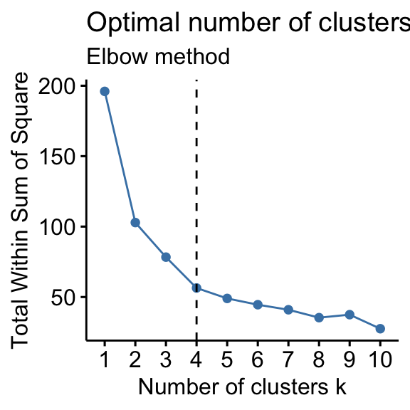

Лабораторная работа №4. Векторный поиск на основе кластеризации
===============================================================

.. toctree::
    :maxdepth: 1
    :titlesonly:
    :caption: Full API

    lab_4_retrieval_w_clustering.api.rst

Дано
----

1. Хранящиеся в папке ``assets/texts`` 10 глав художественного произведения
   "Мастер и Маргарита" и 10 глав первого тома романа "Война и Мир" на русском языке.
2. Список стоп-слов русского языка из библиотеки ``NLTK``, хранящийся в файле
   ``assets/stopwords.txt``. Стоп-слова уже импортированы в файл ``start.py``
   в функции ``open_files()`` в переменную ``stopwords`` в виде списка.

В предыдущих лабораторных работах Вы научились:

* обрабатывать входящие текстовые данные;
* получать векторные представления текстов (эмбеддинги) на основе метрики BM25;
* получать релевантные документы на основе различных метрик таких, как TF-IDF, BM25
  и оптимизированной метрики BM25;
* оптимизировать алгоритм векторного поиска с помощью метода KNN и структуры данных KDTree.

В настоящей лабораторной работе Вам предстоит построить полноценную интеграционную систему
векторного поиска по абзацам, создав собственную базу текстовых данных и оптимизировав
векторный поиск с помощью алгоритма кластеризации K-Means.

Что необходимо сделать
----------------------

Шаг 0. Начать работу над лабораторной
~~~~~~~~~~~~~~~~~~~~~~~~~~~~~~~~~~~~~

1. Измените файлы ``main.py`` и ``start.py``.
2. Закоммитьте изменения и создайте новый Pull Request.

.. important:: Код, выполняющий все требуемые действия, должен быть написан в
               функции ``main`` в модуле ``start.py``.

Для этого реализуйте функции в модуле ``main.py``
и импортируйте их в ``start.py``.
Вызов функции в файле ``start.py``:

.. code:: py

   if __name__ == '__main__':
       main()

В рамках данной лабораторной работы **нельзя использовать модули
collections, itertools, а также сторонние модули.**

Обратите внимание, что желаемую оценку необходимо указать в файле
``settings.json`` в поле ``target_score``. Возможные значения: 0, 4, 6, 8, 10.
Чем выше желаемая оценка, тем больше
тестов запускается при проверке вашего Pull Request.

.. note:: Если на вход в методы классов или функции подаются аргументы неправильных типов,
          то необходимо вызвать исключение ``ValueError``.

Шаг 1. Творческое задание (будет анонсировано преподавателем на лекции)
~~~~~~~~~~~~~~~~~~~~~~~~~~~~~~~~~~~~~~~~~~~~~~~~~~~~~~~~~~~~~~~~~~~~~~~

.. important:: Выполнение Шага 1 соответствует 4 баллам.

Шаг 2. Получить абзацы текста
~~~~~~~~~~~~~~~~~~~~~~~~~~~~~

На протяжении данной лабораторной Вы будете работать с более мелкими единицами, чем текст,
а именно с абзацами. Хранение данных в таком виде позволяет находить более релевантную
информацию под имеющийся запрос.

Для того чтобы получить список абзацев текста, реализуйте функцию
:py:func:`lab_4_retrieval_w_clustering.main.get_paragraphs`.

.. note:: Критерием нового абзаца является перенос строки.

Например, пусть функция принимает на вход следующий текста:

``['Привет! Как твои дела?\nХорошо. Как твои дела?\nУ меня всё отлично\n
Как ты смотришь на то, чтобы сходить попить кофе?']``.

Тогда функция вернет нам следующий список строк:

``['Привет! Как твои дела?', 'Хорошо. Как твои дела?',
'У меня всё отлично', 'Как ты смотришь на то, чтобы сходить попить кофе?']``

Шаг 3. Объявить сущность для векторизации текстов с помощью метрики BM25
~~~~~~~~~~~~~~~~~~~~~~~~~~~~~~~~~~~~~~~~~~~~~~~~~~~~~~~~~~~~~~~~~~~~~~~~

Формальные модели, включая лингвистические модели, не способны обрабатывать
буквенные данные, поэтому необходимо для каждой текстовой последовательности
сформировать числовой вектор.

В лабораторой работе №3 Вы уже познакомились с понятием векторное представление
текстов. В данном случае нам так же необходимо получить вектора абзацев. Для
этого реализуйте класс :py:class:`lab_4_retrieval_w_clustering.main.BM25Vectorizer`.
Данный класс является наследником класса :py:class:`lab_3_ann_retriever.main.Vectorizer`,
который уже был реализован Вами в предыдущей лабораторной. Отличие данного
класса лишь в том, что векторизация происходит не на основе TF-IDF метрики, а на
основе алгоритма BM25.

Класс имеет следующие внутренние атрибуты:

* ``self._corpus`` - список токенизированных абзацев, за вид которых в данной работе
  отвечает тип :py:class:`lab_4_retrieval_w_clustering.main.TokenizedCorpus`;
* ``self._avg_doc_len`` - средняя длина абзацев в корпусе.

.. important:: Оба эти атрибута являются защищенными, то есть обращение
               к ним за пределами методов этого класса не предполагается.

.. note:: Если на вход подается некорректное значение, то необходимо поднять исключение
          ``ValueError``.

При инициализации данного класса заполните внутренние атрибуты дефолтными значениями.
Например, пусть ``self._corpus = []`` и ``self._avg_doc_len = -1.0``.

.. note:: Не забудьте при инициализации класса наследника вызвать
          конструктор класса родителя, чтобы иметь возможность переиспользовать
          все его атрибуты и действия.

Пример инициализации класса:

  .. code-block:: py

    vectorizer = BM25Vectorizer()

Шаг 3.1. Заполнить атрибуты класса BM25Vectorizer
~~~~~~~~~~~~~~~~~~~~~~~~~~~~~~~~~~~~~~~~~~~~~~~~~

Реализуйте метод
:py:meth:`lab_4_retrieval_w_clustering.main.BM25Vectorizer.set_tokenized_corpus`,
который принимает на вход список токенизированных абзацев и заполняет им атрибут
``self._corpus``. Используя полученный корпус, заполните атрибут ``self._avg_doc_len``
корректным значением.

.. note:: Если на вход подается некорректное значение, то необходимо поднять исключение
          ``ValueError``.

Шаг 3.2. Посчитать BM25 для абзаца
~~~~~~~~~~~~~~~~~~~~~~~~~~~~~~~~~~

Реализуйте метод :py:meth:`lab_4_retrieval_w_clustering.main.BM25Vectorizer._calculate_bm25`,
который вычисляет ``BM25`` и создаёт вектор документа.
Для того чтобы сразу учесть неизменяемость размерности вектора, создайте
вектор из нулей длины списка ``self._vocabulary``, атрибута из класса родителя.
Затем заполните созданный вектор значениями ``BM25``.

.. important:: Для вычисления метрики ``BM25`` для токенов документа
               используйте функцию :py:func:`lab_2_retrieval_w_bm25.main.calculate_bm25`.

Например, вектор уже знакомого нам абзаца
``'Привет! Как твои дела?'`` будет выглядеть так:
``(0.0, 0.0, 0.0, 0.0, 0.0, 0.8139979444767895, 0.0, 0.0, 0.0)``.

Шаг 3.3. Векторизировать документ
~~~~~~~~~~~~~~~~~~~~~~~~~~~~~~~~~

Переопределите поведение метода :py:meth:`lab_3_ann_retriever.main.Vectorizer.vectorize`
в классе наследнике :py:class:`lab_4_retrieval_w_clustering.main.BM25Vectorizer`,
который возвращает векторное представление абзаца.

.. important:: Метод должен вызывать защищённый метод
               :py:meth:`lab_4_retrieval_w_clustering.main.BM25Vectorizer._calculate_bm25`.

.. note:: Если на вход подается некорректное значение или вызываемые методы возвращают значение ``None``,
          то необходимо поднять исключение ``ValueError``.

Вызов данного метода может выглядеть следующим образом:

.. code:: py

    tokenized_paragraphs = [['привет', 'твои', 'дела'], ['твои', 'дела']]
    vectorizer = BM25Vectorizer()
    vectorizer.set_tokenized_corpus(tokenized_paragraphs)
    vectorizer.build()
    vectorizer.vectorize(tokenized_paragraphs[0])

Шаг 4. Объявить сущность для создании векторной базы данных
~~~~~~~~~~~~~~~~~~~~~~~~~~~~~~~~~~~~~~~~~~~~~~~~~~~~~~~~~~~

В предыдущей лабораторной работе для того, чтобы получить ответ на некоторый запрос,
необходимо было проиндексировать хранящиеся для сравнения документы, каждый раз
вызывая при добавлении нового документа метод
:py:meth:`lab_3_ann_retriever.main.BasicSearchEngine.index_documents`.

В больших поисковых системах, данные не обрабатываются и не векторизируются
при каждом запросе заново. Вместо этого они предварительно
индексируются и хранятся в специализированных базах данных, чтобы обеспечить
быструю и эффективную обработку запросов пользователей. Кроме того,
создание таких баз данных позволяет хранение документов и их векторов в одном месте.

В данной лабораторной работе Вы создаете прототип поисковой системы. Следовательно,
необходимо создать базу данных, которая будет хранить документы и их вектора.
Для этого реализуйте класс :py:class:`lab_4_retrieval_w_clustering.main.DocumentVectorDB`.

Класс имеет следующие внутренние атрибуты:

* ``self._tokenizer`` - объект класса :py:class:`lab_3_ann_retriever.main.Tokenizer`;
* ``self._vectorizer`` - объект класса :py:class:`lab_4_retrieval_w_clustering.main.BM25Vectorizer`;
* ``self.__documents`` - список абзацев, за вид которых в данной работе
  отвечает тип :py:class:`lab_4_retrieval_w_clustering.main.Corpus`;
* ``self.__vectors`` - словарь, который хранит в себе уникальный индекс абзаца в качестве ключа и
  вектор данного абзаца (за вид вектора абзаца отвечает тип
  :py:class:`lab_3_ann_retriever.main.Vector`).

.. important:: Атрибуты ``self._tokenizer`` и ``self._vectorizer`` являются защищенными, а
               атрибуты ``self.__documents`` и ``self.__vectors`` - приватными. Подумайте,
               почему так сделано, и выскажите предположение ментору в процессе защиты
               лабораторной работы.

.. note:: Если на вход подается некорректное значение или вызываемые методы возвращают значение ``None``,
          то необходимо поднять исключение ``ValueError``.

Пример инициализации класса:

  .. code-block:: py

    stop_words = ['и', 'в', 'во', 'не']
    db = DocumentVectorDB(stop_words)

Шаг 4.1. Заполнить базу данных абзацами и их векторными представлениями
~~~~~~~~~~~~~~~~~~~~~~~~~~~~~~~~~~~~~~~~~~~~~~~~~~~~~~~~~~~~~~~~~~~~~~~

Реализуйте метод
:py:meth:`lab_4_retrieval_w_clustering.main.DocumentVectorDB.put_corpus`,
который принимает на вход список абзацев и заполняет атрибуты
``self.__documents`` и ``self.__vectors``.

Для заполнения атрибута ``self.__vectors`` Вам потребуется использовать
метод :py:meth:`lab_3_ann_retriever.main.Tokenizer.tokenize`, а также метод
:py:meth:`lab_4_retrieval_w_clustering.main.BM25Vectorizer.vectorize`, предварительно
заполнив атрибуты ``self._corpus``, ``self._avg_doc_len`` и ``self._vocabulary``,
используя объект класса :py:class:`lab_4_retrieval_w_clustering.main.BM25Vectorizer`.

.. note:: Обратите внимание, что если документ состоит полностью из стоп-слов, то после токенизации
          возвращается пустой список. В данном случае необходимо пропускать такие значения и не добавлять
          в корпус токенизированных документов.

.. note:: Если на вход подается некорректное значение или вызываемые методы возвращают значение ``None``,
          то необходимо поднять исключение ``ValueError``.

Шаг 4.2. Получить векторизатор
~~~~~~~~~~~~~~~~~~~~~~~~~~~~~~

Реализуйте метод
:py:meth:`lab_4_retrieval_w_clustering.main.DocumentVectorDB.get_tokenizer`,
который возвращает объект класса :py:class:`lab_4_retrieval_w_clustering.main.BM25Vectorizer`.

Шаг 4.3. Получить токенизатор
~~~~~~~~~~~~~~~~~~~~~~~~~~~~~

Реализуйте метод
:py:meth:`lab_4_retrieval_w_clustering.main.DocumentVectorDB.get_vectorizer`,
который возвращает объект класса :py:class:`lab_3_ann_retriever.main.Tokenizer`.

Шаг 4.4. Получить вектора по индексам
~~~~~~~~~~~~~~~~~~~~~~~~~~~~~~~~~~~~~

Реализуйте метод
:py:meth:`lab_4_retrieval_w_clustering.main.DocumentVectorDB.get_vectors`.

В случае, если на вход приходит значение ``None``, ожидается, что
метод вернёт все пары индекс и вектор соответствующего документа.

В противном случае, возвращаются только те пары, индекс которых присутствует
в списке полученных на вход индексов.

Шаг 4.5. Получить документы по индексам
~~~~~~~~~~~~~~~~~~~~~~~~~~~~~~~~~~~~~~~

Реализуйте метод
:py:meth:`lab_4_retrieval_w_clustering.main.DocumentVectorDB.get_raw_documents`, который
как и метод :py:meth:`lab_4_retrieval_w_clustering.main.DocumentVectorDB.get_vectors`
принимает индексы.

В случае, если на вход приходит значение ``None``, метод возвращает все документы,
хранящиеся в базе данных.

В противном случае, возвращаются только те документы, индексы которых присутствуют
в списке полученных на вход индексов.

Шаг 5. Объявить сущность для поиска наиболее релевантного документа
~~~~~~~~~~~~~~~~~~~~~~~~~~~~~~~~~~~~~~~~~~~~~~~~~~~~~~~~~~~~~~~~~~~

Теперь, когда векторная база данных создана, необходимо проверить её работу
на базовом алгоритме K-ближайших соседей. Для этого реализуйте класс
:py:class:`lab_4_retrieval_w_clustering.main.VectorDBSearchEngine`.
Его основная функция — ранжирование документов по степени схожести с запросом.

Данный класс наследуется от уже реализованного в предыдущей лабораторной работе
класса :py:class:`lab_3_ann_retriever.main.BasicSearchEngine`. В данном случае
наследование позволит использовать методы класса родителя, а также переопределить
некоторые из них.

Данный класс имеет единственный внутренний атрибут ``self._db``, который
хранит в себе объект класса :py:class:`lab_4_retrieval_w_clustering.main.DocumentVectorDB`.

Инициализация данного класса может выглядеть следующим образом:

.. code:: py

    stop_words = ['и', 'в', 'во', 'не']
    db = DocumentVectorDB(stop_words)
    vector_search = VectorDBSearchEngine(db)

Шаг 5.1. Получить релевантные абзацы
~~~~~~~~~~~~~~~~~~~~~~~~~~~~~~~~~~~~

Теперь реализуйте поиск ближайших соседей по запросу с помощью метода
:py:meth:`lab_4_retrieval_w_clustering.main.VectorDBSearchEngine.retrieve_relevant_documents`.
На вход подаётся строка запроса и количество соседей,
которое мы хотим получить.

Благодаря тому, что была создана векторная база данных, не требуется дополнительно
токенизировать и векторизировать данные. Теперь Вы можете получить все необходимые данные
из объекта класса :py:class:`lab_4_retrieval_w_clustering.main.DocumentVectorDB`, которых
хранится в соответствующем атрибуте.

.. important:: В данном методе необходимо использовать метод
               :py:meth:`lab_3_ann_retriever.main.BasicSearchEngine._calculate_knn`
               для нахождения наиболее релевантных ``n`` документов, а так же
               метод :py:meth:`lab_4_retrieval_w_clustering.main.DocumentVectorDB.get_raw_documents`
               для получения релевантных документов по индексу

.. note:: Если на вход подается некорректное значение или вызываемые методы возвращают значение ``None``,
          то необходимо поднять исключение ``ValueError``.

Например, пусть метод получает на вход запрос ``'Может сходим за кофе?'`` и количество релевантных
документов равное ``2``.

Тогда ожидается, что метод вернёт следующий результат:

``[(0.9658317579543253, 'Хорошо. Как твои дела?'),
(1.246293814290532, 'Как ты смотришь на то, чтобы сходить попить кофе?')]``

Шаг 6. Продемонстрировать работу реализации в ``start.py``
~~~~~~~~~~~~~~~~~~~~~~~~~~~~~~~~~~~~~~~~~~~~~~~~~~~~~~~~~~

.. important:: Выполнение Шагов 2-6 соответствует 6 баллам.

Продемонстрируйте результат работы токенизации по параграфам,
векторизации BM25, заполнения базы данных и ранжирования документов по релевантности
в функции ``main()`` модуля ``start.py``.
Попробуйте в качестве запроса для поиска использовать
``"Первый был не кто иной, как Михаил Александрович Берлиоз, председатель правления"``,
и пусть значение n_neighbours будет равно 3.

Шаг 7. Реализовать алгоритм кластеризации
~~~~~~~~~~~~~~~~~~~~~~~~~~~~~~~~~~~~~~~~~

На предыдущих шагах Вы осуществили поиск релевантных абзацев по запросу
на основе алгоритма K-ближайших соседей (KNN). Однако, при таком подходе
необходимо находить расстояние между вектором запроса и вектором каждого
абзаца из базы данных. В данной лабораторной работе таких абзацев всего
``1730``, тогда как в поисковых системах, таких абзацев-документов
миллиарды. Именно поэтому полный перебор всех элементов дорого.
Чтобы сократить число таких переборов зачастую
используют различные алгоритмы, в частности алгоритм кластеризации.

Алгоритмы кластеризации позволяет группировать данные в наборы объектов,
называемых кластерами, тем самым сокращая пространство поиска. В один кластер попадают
объекты, которые имеют высокую степень сходства между собой, а различия между разными
группами будут значительными. Таким образом, вместо того чтобы сравнивать запрос с каждым
элементом базы данных, мы можем сначала определить, к какому кластеру относится запрос,
и затем выполнять поиск уже среди членов этого кластера. Это позволяет ускорить процесс
поиска в несколько раз.

Помимо скорости, кластеризация, при достаточно большое базе данных, может улучшить качество
поиска, так как она группирует похожие элементы вместе. Это делает результаты поиска более
релевантными, поскольку запросы будут сопоставляться с объектами, которые уже были отобраны,
как наиболее наиболее релевантные среди всех документов.

За счёт сокращения векторного пространства поиска применение алгоритма кластеризации
также ведет в снижению памяти, так как требуется хранить значительно меньшее количество
документов для сравнения и соответственно меньше дистанций.

В данной лабораторной работе Вам необходимо реализовать алгоритм кластеризации K-Means.
Теперь давайте более подробно познакомимся с данным алгоритмом кластеризации.

Алгоритм **K-Means** — это базовый метод кластерного анализа, используемый для разбиения
множества точек данных на ``k`` кластеров, где ``k`` — фиксированное количество кластеров.
Каждый кластер характеризуется своим центром, называемым центроидом. Основная идея состоит
в том, чтобы минимизировать суммарную ошибку размещения точек относительно их центроидов.

Работа алгоритма кластеризации можно разделить на два основных этапа:

1. **Тренировка (Training)** – создание модели кластеризации на основе обучающих данных.
2. **Инференс (Inference)** – использование созданной модели для предсказания принадлежности
   новых данных к определенным кластерам.

Этап тренировки описывается следующими шагами:

1. **Инициализация центроидов**. На данном шаге случайным образом выбираются ``k``
   векторов из базы данных. Данные вектора служат начальными центроидами для кластеров.
2. **Цикл обучения**.
   Сначала происходит присвоение точек кластеру. Для каждой точки данных
   вычисляется расстояние до каждого центроида. Точка присваивается тому кластеру,
   центроид которого находится ближе к ней.
   Затем необходимо пересчитать центроиды, так как из-за добавления в кластер новых
   векторов, центроид может сдвинуться. Обновление центроида происходит следующим образом:
   считается среднее значение векторов, принадлежащих каждому кластеру.
3. **Проверка сходимости**. Алгоритм проверяет, изменилось ли положение центроидов больше,
   чем на определенный порог. Если значительных изменений в координатах центроидов не произошло,
   значит алгоритм достиг сходимости и процесс обучения можно заканчивать.

После того как модель была обучена, ее можно использовать для предсказания того, к какому кластеру
относятся новые набор данных. Данный процесс называется инференсом. Модель использует
информацию о центрах кластеров, полученных на этапе тренировки, чтобы назначить каждому новому элементу
соответствующий кластер.

Визуализацию K-Means кластеризации, Вы можете найти
`тут <https://www.naftaliharris.com/blog/visualizing-k-means-clustering/>`__

Шаг 7.1. Объявить сущность для хранения кластеров
~~~~~~~~~~~~~~~~~~~~~~~~~~~~~~~~~~~~~~~~~~~~~~~~~

Для того, чтобы реализовать алгоритм кластеризации K-means, необходимо создать
сущность, которая будет хранить в себе ключевую информацию о кластере. Для этого
реализуйте класс :py:class:`lab_4_retrieval_w_clustering.main.ClusterDTO`.

Класс имеет следующие внутренние атрибуты:

* ``self._centroid`` - вектор центроида кластера (за вид вектора отвечает тип
  :py:class:`lab_3_ann_retriever.main.Vector`);
* ``self.__indices`` - индексы документов, которые относятся к текущему кластеру.

.. important:: Атрибут ``self._centroid`` является защищенным, а
               атрибут ``self.__indices`` - приватным. Подумайте,
               почему так сделано, и выскажите предположение ментору в процессе защиты
               лабораторной работы.

.. note:: Если на вход подается некорректное значение или вызываемые методы возвращают значение ``None``,
          то необходимо поднять исключение ``ValueError``.

.. code:: py

    centroid = (0.0, 0.23, 0.0, 0.15, 0.0, 0.0, 0.0, 0.12, 0.0)
    cluster = ClusterDTO(centroid)

Шаг 7.1.1. Получить количество документов в кластере
~~~~~~~~~~~~~~~~~~~~~~~~~~~~~~~~~~~~~~~~~~~~~~~~~~~~

Реализуйте магический метод
:py:meth:`lab_4_retrieval_w_clustering.main.ClusterDTO.__len__`, который
позволяет получить количество документов в кластере.

Метод ``__len__`` называют магическим, потому что его переопределение меняет поведение объекта
в случае, когда необходимо получить его длину. Данный метод он вызывается при использовании
встроенной функции ``len()``, поэтому результат переопределения можно проверить, вызвав
``len``, передав экземпляр класса в качестве аргумента.

Шаг 7.1.2. Получить центроид
~~~~~~~~~~~~~~~~~~~~~~~~~~~~

Реализуйте метод
:py:meth:`lab_4_retrieval_w_clustering.main.ClusterDTO.get_centroid`, который
позволяет получить доступ к приватному атрибуту, хранящему центроид кластера.

Шаг 7.1.3. Изменить центроид
~~~~~~~~~~~~~~~~~~~~~~~~~~~~

После того, как в алгоритме кластеризации центроиды будут обновлены, необходимо
сообщить об этом изменении кластеру, то есть сохранить эту информацию в объекте
текущего класса. Для того, чтобы после обновления сохранить актуальную информацию
о центроиде, реализуйте метод :py:meth:`lab_4_retrieval_w_clustering.main.ClusterDTO.set_new_centroid`,
который изменяет текущее состояние атрибута ``self._centroid``.

Шаг 7.1.4. Очистить кластеры
~~~~~~~~~~~~~~~~~~~~~~~~~~~~

До тех пор, пока центроиды не достигли сходимости, необходимо их обновлять. Но
каждый раз после их обновления, экземпляр текущего класса продолжает хранить
в себе информацию об индексах документов, хранящихся в кластере. Данное поведение
является некорректным, так как получив новые центроиды, кластеры должны формироваться
заново. Для того, чтобы происходило очищение кластера, реализуйте метод
:py:meth:`lab_4_retrieval_w_clustering.main.ClusterDTO.erase_indices`.

Шаг 7.1.5. Добавить новый документ в кластер
~~~~~~~~~~~~~~~~~~~~~~~~~~~~~~~~~~~~~~~~~~~~

Кластеру необходимо иметь возможность добавлять в себя новый элемент.
Для того, чтобы кластер мог осуществить данное действие, реализуйте
метод :py:meth:`lab_4_retrieval_w_clustering.main.ClusterDTO.add_document_index`,
который пополняет соответствующий атрибут данного класса индексом нового документа.

.. note:: Если на вход подается некорректное значение,
          то необходимо поднять исключение ``ValueError``.

Шаг 7.1.6. Получить индексы документов кластера
~~~~~~~~~~~~~~~~~~~~~~~~~~~~~~~~~~~~~~~~~~~~~~~

Реализуйте метод :py:meth:`lab_4_retrieval_w_clustering.main.ClusterDTO.get_indices`,
который позволяет получить список всех индексов документов, которые хранятся
в текущем кластере. В дальнейшем такое поведение позволит получить документы кластера,
наиболее близкого к пользовательскому запросу, а следовательно, получить наиболее
релевантные документы.

Шаг 7.2. Объявить сущность для алгоритма кластеризации
~~~~~~~~~~~~~~~~~~~~~~~~~~~~~~~~~~~~~~~~~~~~~~~~~~~~~~

Теперь Вам необходимо реализовать алгоритм кластеризации K-Means. Для
этого реализуйте класс :py:class:`lab_4_retrieval_w_clustering.main.KMeans`.

Класс имеет следующие внутренние атрибуты:

* ``self.__clusters`` - список, который хранит в себе объекты класса
  :py:class:`lab_4_retrieval_w_clustering.main.ClusterDTO`;
* ``self._db`` - объект класса :py:class:`lab_4_retrieval_w_clustering.main.DocumentVectorDB`,
  который хранит в себе векторную базу данных;
* ``self._n_clusters`` - количество кластеров.

.. important:: Атрибуты ``self._db`` и ``self._n_clusters`` являются защищенными, а
               атрибут ``self.__clusters`` - приватным. Подумайте,
               почему так сделано, и выскажите предположение ментору в процессе защиты
               лабораторной работы.

.. note:: Если на вход подается некорректное значение или вызываемые методы возвращают значение ``None``,
          то необходимо поднять исключение ``ValueError``.

.. code:: py

    stop_words = ['и', 'в', 'во', 'не']
    db = DocumentVectorDB(stop_words)
    kmeans = KMeans(db, n_clusters=2)

Шаг 7.2.1. Запустить итерацию обучения алгоритма кластеризации
~~~~~~~~~~~~~~~~~~~~~~~~~~~~~~~~~~~~~~~~~~~~~~~~~~~~~~~~~~~~~~

Как уже рассматривалось выше, алгоритм необходимо обучать до тех пор,
пока центроиды кластера не сойдутся к заданному порогу. Для того, чтобы
пройти одну полную итерацию обучения, реализуйте метод
:py:meth:`lab_4_retrieval_w_clustering.main.KMeans.run_single_train_iteration`,
который возвращает список обновленных объектов класса
:py:class:`lab_4_retrieval_w_clustering.main.ClusterDTO`.

В ходе реализации данного метода необходимо предпринять следующие шаги:

1. Очистить индексы документов в каждом кластере, так как, пока центроиды не сошлись,
   необходимо заново заполнять кластеры индексами документов на основе новых центроидов.
2. Посчитать расстояние от каждого вектора документа из базы данных до центроида
   каждого кластера.
3. Для каждого документа найти ближайший к нему центроид.
4. Заполнить текущий кластер новым индексом документа.
5. Обновить центроид каждого кластера, посчитав его вектор, как среднее арифметическое
   векторов документов ткущего кластера.

.. important:: В данном методе необходимо использовать следующие методы:
               :py:meth:`lab_4_retrieval_w_clustering.main.ClusterDTO.erase_indices`,
               :py:meth:`lab_4_retrieval_w_clustering.main.DocumentVectorDB.get_vectors`,
               :py:meth:`lab_4_retrieval_w_clustering.main.ClusterDTO.get_centroid`,
               :py:meth:`lab_4_retrieval_w_clustering.main.ClusterDTO.add_document_index`,
               и :py:meth:`lab_4_retrieval_w_clustering.main.ClusterDTO.set_new_centroid`,
               а также функцию
               :py:func:`lab_3_ann_retriever.main.calculate_distance`

.. note:: Если вызываемые методы возвращают значение ``None``,
          то необходимо поднять исключение ``ValueError``.

Шаг 7.2.2. Проверить сходимость центроидов
~~~~~~~~~~~~~~~~~~~~~~~~~~~~~~~~~~~~~~~~~~

Реализуйте метод
:py:meth:`lab_4_retrieval_w_clustering.main.KMeans._is_convergence_reached`,
который проверяет сошлись ли центроиды до обновления с центроидами после обновления.

Считается, что центроиды сошлись, если расстояние между ними меньше некоторого
порогового значения, которое подается на вход данному методу. В таком случае, метод
возвращает значение ``True``.

.. important:: В данном методе необходимо вызвать функцию
               :py:func:`lab_3_ann_retriever.main.calculate_distance`, а
               также метод :py:meth:`lab_4_retrieval_w_clustering.main.ClusterDTO.get_centroid`,
               чтобы получить центроиды до и после обновления.

.. note:: Если вызываемые методы возвращают значение ``None``,
          то необходимо поднять исключение ``ValueError``.

Шаг 7.2.3. Натренировать алгоритм кластеризации
~~~~~~~~~~~~~~~~~~~~~~~~~~~~~~~~~~~~~~~~~~~~~~~

Теперь у Вас есть всё, чтобы обучить алгоритм кластеризации K-Means.
Реализуйте метод :py:meth:`lab_4_retrieval_w_clustering.main.KMeans.train`.

Рассмотрим реализацию данного метода по шагам:

1. **Инициализация центроидов**. В данной лабораторной работе в качестве начальных
   центроидов необходимо взять первые ``n`` векторов из построенной базы данных, которая
   хранится в соответствующем атрибуте текущего класса. Затем Вам необходимо заполнить
   атрибут ``self.__clusters`` объектами класса
   :py:class:`lab_4_retrieval_w_clustering.main.ClusterDTO`.
2. **Цикл обучения**.
   За логику одной итерации обучения отвечает уже реализованный ранее метод
   :py:meth:`lab_4_retrieval_w_clustering.main.KMeans.run_single_train_iteration`,
   который возвращает новые кластера после обновления центроидов.
3. **Проверка сходимости**. В случае, если центроиды сошлись, необходимо закончить цикл обучения
   и заключительный раз обновить кластера, чтобы поддерживать объекты класса
   :py:class:`lab_4_retrieval_w_clustering.main.ClusterDTO` в актуальном состоянии. В
   противном случае, происходит переход на новую итерацию обучения.

.. important:: В данном методе необходимо использовать следующие методы:
               :py:meth:`lab_4_retrieval_w_clustering.main.DocumentVectorDB.get_vectors`,
               :py:meth:`lab_4_retrieval_w_clustering.main.KMeans.run_single_train_iteration`
               и :py:meth:`lab_4_retrieval_w_clustering.main.KMeans._is_convergence_reached`.

Шаг 7.2.4. Сделать инференс модели кластеризации
~~~~~~~~~~~~~~~~~~~~~~~~~~~~~~~~~~~~~~~~~~~~~~~~

Теперь, когда Вы натренировали модель на то, чтобы определять кластер для документа,
реализуйте метод :py:meth:`lab_4_retrieval_w_clustering.main.KMeans.infer`, который
позволит получить ближайший кластер к запросу пользователя.

Для того, чтобы реализовать данный метод, необходимо выполнить следующие шаги:

1. Найти расстояние между вектором запроса и центроидом каждого кластера. Кластер,
   центроид которого имеет наименьшее расстояние до вектора запроса, выбирается для
   дальнейшего поиска наиболее релевантных документов.
2. Получить индексы тех документов, которые содержаться в ближайшем к запросу
   пользователя кластере.
3. Получить вектора документов из кластера по индексу.
4. Найти расстояние между вектором запроса и вектором каждого документа из ближайшего кластера.
5. Выбрать ``n`` ближайших документов кластера.

.. important:: В данном методе необходимо использовать функцию
               :py:func:`lab_3_ann_retriever.main.calculate_distance`, а также
               следующие методы:
               :py:meth:`lab_4_retrieval_w_clustering.main.ClusterDTO.get_centroid`,
               :py:meth:`lab_4_retrieval_w_clustering.main.DocumentVectorDB.get_vectors` и
               :py:meth:`lab_4_retrieval_w_clustering.main.ClusterDTO.get_indices`.

.. note:: Если на вход подается некорректное значение или вызываемые методы возвращают значение ``None``,
          то необходимо поднять исключение ``ValueError``.

Например, пусть метод принимает на вход следующий вектор запроса
``(0.0, 0.0, 0.9658317579543253, 0.0, 0.0, 0.0, 0.0, 0.0, 0.0)`` и количество релевантных
документов равное ``2``.

Тогда метод вернёт следующий результат:

``[(0.9658317579543253, 1), (1.246293814290532, 3)]``

Шаг 8. Объявить сущность для поиска релевантных документов с помощью алгоритма K-Means
~~~~~~~~~~~~~~~~~~~~~~~~~~~~~~~~~~~~~~~~~~~~~~~~~~~~~~~~~~~~~~~~~~~~~~~~~~~~~~~~~~~~~~

На шаге 5 Вы уже создали алгоритм поиска ``n`` релевантных документов, основываясь на
алгоритме K-ближайших соседей. Теперь осуществим поиск релевантных документов на основе K-Means
алгоритма. Для этого реализуйте класс
:py:class:`lab_4_retrieval_w_clustering.main.ClusteringSearchEngine`.

Класс имеет следующие внутренние атрибуты:

* ``self.__algo`` - объект класса :py:class:`lab_4_retrieval_w_clustering.main.KMeans`;
* ``self._db`` - объект класса :py:class:`lab_4_retrieval_w_clustering.main.DocumentVectorDB`,
  который хранит в себе векторную базу данных.

При инициализации класса :py:class:`lab_4_retrieval_w_clustering.main.ClusteringSearchEngine`
обратите внимание на то, что атрибут ``self.__algo`` хранит в себе лишь объект класса. Для того,
чтобы использовать алгоритм K-Means дальше, необходимо его натренировать.

.. important:: Атрибут ``self._db`` является защищенным, а
               атрибут ``self.__algo`` - приватным. Подумайте,
               почему так сделано, и выскажите предположение ментору в процессе защиты
               лабораторной работы.

.. note:: Если на вход подается некорректное значение или вызываемые методы возвращают значение ``None``,
          то необходимо поднять исключение ``ValueError``.

.. code:: py

    stop_words = ['и', 'в', 'во', 'не']
    db = DocumentVectorDB(stop_words)
    clustering_search = ClusteringSearchEngine(db, n_clusters=2)

Шаг 8.1. Получить релевантные абзацы с помощью алгоритма K-Means
~~~~~~~~~~~~~~~~~~~~~~~~~~~~~~~~~~~~~~~~~~~~~~~~~~~~~~~~~~~~~~~~

Реализуйте метод
:py:meth:`lab_4_retrieval_w_clustering.main.ClusteringSearchEngine.retrieve_relevant_documents`.
На вход подаётся строка запроса и количество релевантных данному запросу документов.

Вам необходимо сделать инференс модели кластеризации и получить индексы ближайших
к пользовательскому запросу документов. Однако, обратите внимание на то, что
на выходе метод ожидает получить дистанции и сами документы в формате строки.

.. important:: В данном методе необходимо использовать метод
               :py:meth:`lab_3_ann_retriever.main.Tokenizer.tokenize`,
               :py:meth:`lab_4_retrieval_w_clustering.main.BM25Vectorizer.vectorize`,
               :py:meth:`lab_4_retrieval_w_clustering.main.DocumentVectorDB.get_raw_documents`,
               а также :py:meth:`lab_4_retrieval_w_clustering.main.KMeans.infer`.

.. note:: Если на вход подается некорректное значение или вызываемые методы возвращают значение ``None``,
          то необходимо поднять исключение ``ValueError``.

Шаг 9. Продемонстрировать работу реализации в ``start.py``
~~~~~~~~~~~~~~~~~~~~~~~~~~~~~~~~~~~~~~~~~~~~~~~~~~~~~~~~~~

.. important:: Выполнение Шагов 7-9 соответствует 8 баллам.

Продемонстрируйте результат ранжирования документов по релевантности
с помощью K-Means алгоритма в функции ``main()`` модуля ``start.py``.
Попробуйте в качестве запроса для поиска использовать
``"Первый был не кто иной, как Михаил Александрович Берлиоз, председатель правления"``,
и пусть значение ``n_neighbours`` будет равно 5.

Шаг 10. Проанализировать результат работы K-Means кластеризации
~~~~~~~~~~~~~~~~~~~~~~~~~~~~~~~~~~~~~~~~~~~~~~~~~~~~~~~~~~~~~~~

На предыдущих шагах Вы построили алгоритм кластеризации K-Means,
который позволяет разбивать данные на группы (кластеры).

При создании экземпляров класса :py:class:`lab_4_retrieval_w_clustering.main.KMeans`
и класса :py:class:`lab_4_retrieval_w_clustering.main.ClusteringSearchEngine`
количество кластеров задавалось произвольно.

Однако существуют различные способы подбора наиболее подходящего количества
кластеров. Один из таких способов называется **метод локтя (elbow method)**.

**Метод локтя** – это подход для определения оптимального
числа кластеров при использовании алгоритмов кластерного анализа K-Means.
Этот метод основан на анализе суммы квадратов ошибок (SSE),
которая представляет собой сумму квадратов расстояний между объектами кластера и центроидом
соответствующего кластера. Метод локтя помогает выбрать количество кластеров
таким образом, чтобы минимизировать ``SSE``, но при этом избежать чрезмерной фрагментации
данных.

Метрика ``SSE`` считается по следующей формуле:

:math:`\sum^{j=1}_{k}\sum^{i=1}_{n}\sum^{p=1}_{l}({c_j}^p - {v_{i,j}}^p)^2`, где

* ``l`` — размерность вектора;
* ``n`` — количество объектов в кластере;
* ``k`` — число кластеров;
* :math:`{c_j}^p` — p-ый элемент вектора центроида j-того кластера;
* :math:`{v_{i,j}}^p` - p-ый элемент i-ого вектора объекта в j-том кластере.

Метрику ``SSE`` принято считать для разного количества кластеров и по полученным значениям
строить график. На графике ищется точка "излома", где дальнейшее увеличение числа кластеров
приводит к незначительному уменьшению суммы квадратов расстояний.

Пример такого графика представлен на следующем изображении:

Глядя на график, можно догадаться, почему подход называется «метод локтя».
Оптимальное значение количества кластеров соответствует
точке «изгиба локоть».

Шаг 10.1. Посчитать метрику SSE
~~~~~~~~~~~~~~~~~~~~~~~~~~~~~~~

Реализуйте метод
:py:meth:`lab_4_retrieval_w_clustering.main.KMeans.calculate_square_sum`.

Рассмотрим реализацию данного метода по шагам:

1. Получить для каждого кластера из атрибута ``self.__clusters`` центроид
   и документы, хранящиеся в данном кластере.
2. Посчитать сумму квадратов разности координат для каждой пары центроид
   кластера и документ кластера.
3. Посчитать сумму полученных на предыдущем шаге значений внутри одного кластера.
4. Посчитать сумму полученных значений на шаге 3 для всех кластеров.

.. important:: В данном методе необходимо использовать метод
               :py:meth:`lab_4_retrieval_w_clustering.main.ClusterDTO.get_centroid`,
               :py:meth:`lab_4_retrieval_w_clustering.main.DocumentVectorDB.get_vectors` и
               :py:meth:`lab_4_retrieval_w_clustering.main.ClusterDTO.get_indices`.

Шаг 10.2. Получить метрику SSE в поисковой системе
~~~~~~~~~~~~~~~~~~~~~~~~~~~~~~~~~~~~~~~~~~~~~~~~~~

Реализуйте метод
:py:meth:`lab_4_retrieval_w_clustering.main.ClusteringSearchEngine.calculate_square_sum`,
который возвращает сумму квадратов расстояний от векторов кластера до центроида.

.. important:: В данном методе необходимо использовать метод
               :py:meth:`lab_4_retrieval_w_clustering.main.KMeans.calculate_square_sum`.

Шаг 11. Создать отчёт с информацией о кластерах
~~~~~~~~~~~~~~~~~~~~~~~~~~~~~~~~~~~~~~~~~~~~~~~

Шаг 11.1. Получить информацию о кластерах
~~~~~~~~~~~~~~~~~~~~~~~~~~~~~~~~~~~~~~~~~

Реализуйте метод
:py:meth:`lab_4_retrieval_w_clustering.main.KMeans.get_clusters_info`.

Данный метод позволяет получить некоторую информацию о полученных кластерах, а
именно идентификатор кластера и несколько самых ближайших к центроиду документов
из текущего кластера. Количество ближайших документов задается входящим аргументом.

.. important:: В данном методе необходимо использовать функцию
               :py:func:`lab_3_ann_retriever.main.calculate_distance`, а также методы
               :py:meth:`lab_4_retrieval_w_clustering.main.ClusterDTO.get_centroid`,
               :py:meth:`lab_4_retrieval_w_clustering.main.DocumentVectorDB.get_vectors`,
               :py:meth:`lab_4_retrieval_w_clustering.main.ClusterDTO.get_indices` и
               :py:meth:`lab_4_retrieval_w_clustering.main.DocumentVectorDB.get_raw_documents`.

.. note:: Если вызываемые методы возвращают значение ``None``,
          то необходимо поднять исключение ``ValueError``.

Шаг 11.2. Сохранить отчёт в формате json
~~~~~~~~~~~~~~~~~~~~~~~~~~~~~~~~~~~~~~~~

Реализуйте метод :py:meth:`lab_4_retrieval_w_clustering.main.ClusteringSearchEngine.make_report`,
который сохраняет полученную в методе
:py:meth:`lab_4_retrieval_w_clustering.main.KMeans.get_clusters_info` информацию о кластерах в
файл ``assets/report.json``.

Шаг 12. Продемонстрировать работу реализации в ``start.py``
~~~~~~~~~~~~~~~~~~~~~~~~~~~~~~~~~~~~~~~~~~~~~~~~~~~~~~~~~~~

Продемонстрируйте результат отчёта по кластеризации в функции
``main()`` модуля ``start.py``.

.. important:: Проведите анализ полученной информации. Ответьте на вопрос
               ``Что объединяет те документы, которые попали в один кластер?``.
               Поделитесь ответом с менторов во время защиты данной лабораторной
               работы.

Продемонстрируйте в функции ``main()`` модуля ``start.py``
работу метода локтя для каждого кластера в диапазоне ``[1, 15)``.

.. important:: Проведите анализ того, какое количество кластеров является
               наиболее оптимальным.

Шаг 13. Предоставить унифицированный API для всех поисковых систем
~~~~~~~~~~~~~~~~~~~~~~~~~~~~~~~~~~~~~~~~~~~~~~~~~~~~~~~~~~~~~~~~~~

Теперь, когда все алгоритмы проанализированы и реализованы, Вы можете
создать единый API для работы с ними. Унификация интерфейса позволит
упростить работу пользователя с имеющимися сущностями.

На данный момент у Вас реализованы следующие оптимизированные алгоритмы векторного
поиска: :py:class:`lab_4_retrieval_w_clustering.main.VectorDBSearchEngine`,
:py:class:`lab_4_retrieval_w_clustering.main.ClusteringSearchEngine`, а также
:py:class:`lab_3_ann_retriever.main.BasicSearchEngine` и
:py:class:`lab_3_ann_retriever.main.AdvancedSearchEngine`. Однако два последних
не умеют работать с векторной базой данных. Необходимо добавить им такое поведение.

Для этого реализуйте класс
:py:class:`lab_4_retrieval_w_clustering.main.VectorDBEngine`, который предоставит
унифицированный интерфейс для алгоритма :py:class:`lab_3_ann_retriever.main.BasicSearchEngine`
и алгоритма :py:class:`lab_3_ann_retriever.main.AdvancedSearchEngine` и добавляет
возможность работать данным классам с базой документов и векторов.

Класс имеет следующие внутренние атрибуты:

* ``self._db`` - объект класса :py:class:`lab_4_retrieval_w_clustering.main.DocumentVectorDB`,
  который хранит в себе векторную базу данных;
* ``self._engine`` - объект класса :py:class:`lab_3_ann_retriever.main.BasicSearchEngine`.

Шаг 13.1. Предоставить унифицированный API для получения релевантных документов
~~~~~~~~~~~~~~~~~~~~~~~~~~~~~~~~~~~~~~~~~~~~~~~~~~~~~~~~~~~~~~~~~~~~~~~~~~~~~~~

Реализуйте метод
:py:meth:`lab_4_retrieval_w_clustering.main.VectorDBEngine.retrieve_relevant_documents`,
который позволяет получить ``n`` наиболее релевантны[ документов по пользовательскому
запросу с помощью каждого алгоритма.

Шаг 13.2. Предоставить унифицированный API для простого К-мерного дерева
~~~~~~~~~~~~~~~~~~~~~~~~~~~~~~~~~~~~~~~~~~~~~~~~~~~~~~~~~~~~~~~~~~~~~~~~

Реализуйте класс :py:class:`lab_4_retrieval_w_clustering.main.VectorDBTreeSearchEngine`,
который наследуется от созданного ранее класса
:py:class:`lab_4_retrieval_w_clustering.main.VectorDBEngine`.

При инициализации данного класса необходимо создать объект класса
:py:class:`lab_3_ann_retriever.main.BasicSearchEngine` и проиндексировать
все документы, используя векторную базу данных.

.. important:: При инициализации необходимо вызвать методы
               :py:meth:`lab_4_retrieval_w_clustering.main.DocumentVectorDB.get_vectorizer`,
               :py:meth:`lab_4_retrieval_w_clustering.main.DocumentVectorDB.get_tokenizer`,
               :py:meth:`lab_3_ann_retriever.main.SearchEngine.index_documents` и
               :py:meth:`lab_4_retrieval_w_clustering.main.DocumentVectorDB.get_raw_documents`.

Пример инициализации класса:

.. code:: py

    stop_words = ['и', 'в', 'во', 'не']
    db = DocumentVectorDB(stop_words)
    vector_search = VectorDBTreeSearchEngine(db)

Шаг 13.3. Предоставить унифицированный API для оптимизированного К-мерного дерева
~~~~~~~~~~~~~~~~~~~~~~~~~~~~~~~~~~~~~~~~~~~~~~~~~~~~~~~~~~~~~~~~~~~~~~~~~~~~~~~~~

Реализуйте класс :py:class:`lab_4_retrieval_w_clustering.main.VectorDBAdvancedSearchEngine`,
который также наследуется от созданного ранее класса
:py:class:`lab_4_retrieval_w_clustering.main.VectorDBEngine` и перенимает все его атрибуты
и всё его поведение.

При инициализации данного класса необходимо создать объект класса
:py:class:`lab_3_ann_retriever.main.AdvancedSearchEngine` и проиндексировать
все документы, используя векторную базу данных.

.. important:: При инициализации необходимо вызвать методы
               :py:meth:`lab_4_retrieval_w_clustering.main.DocumentVectorDB.get_vectorizer`,
               :py:meth:`lab_4_retrieval_w_clustering.main.DocumentVectorDB.get_tokenizer`,
               :py:meth:`lab_3_ann_retriever.main.SearchEngine.index_documents` и
               :py:meth:`lab_4_retrieval_w_clustering.main.DocumentVectorDB.get_raw_documents`.

Пример инициализации класса:

.. code:: py

    stop_words = ['и', 'в', 'во', 'не']
    db = DocumentVectorDB(stop_words)
    vector_search = VectorDBAdvancedSearchEngine(db)

Шаг 14. Продемонстрировать работу реализации в ``start.py``
~~~~~~~~~~~~~~~~~~~~~~~~~~~~~~~~~~~~~~~~~~~~~~~~~~~~~~~~~~~

.. important:: Выполнение Шагов 10-14 соответствует 10 баллам.

Продемонстрируйте полиморфное поведение классов
:py:class:`lab_4_retrieval_w_clustering.main.VectorDBSearchEngine`,
:py:class:`lab_4_retrieval_w_clustering.main.ClusteringSearchEngine`,
:py:class:`lab_4_retrieval_w_clustering.main.VectorDBTreeSearchEngine` и
:py:class:`lab_4_retrieval_w_clustering.main.VectorDBAdvancedSearchEngine`
в функции ``main()`` модуля ``start.py`` и получить ``5`` наиболее релевантных
документа на пользовательский запрос
``'Первый был не кто иной, как Михаил Александрович Берлиоз, председатель правления'``.

Полезные ссылки
---------------

-  `BM25 <https://ru.wikipedia.org/wiki/Okapi_BM25>`__
-  `Векторный поиск <https://www.datastax.com/guides/what-is-vector-search>`__
-  `K-Means кластеризация <https://www.ibm.com/topics/k-means-clustering>`__
-  `Визуализация K-Means <https://www.naftaliharris.com/blog/visualizing-k-means-clustering/>`__
